<div align="center">

# Nakshatra

**A voice gateway to India's cultural heritage — an ESP32 that listens for its name, a website, and a native Android app, all on one server.**

SIH 2026 · Problem Statement 214 · Cultural Heritage and Traditions of India · PS ID `SIH26214`

[Download the Android app](https://github.com/ANMOLSCRIPT/nakshatra/releases/tag/v1.0.0) ·
[Architecture](docs/architecture.md) ·
[Android project](android/README.md) ·
[Wire protocol](hardware/PROTOCOL.md)

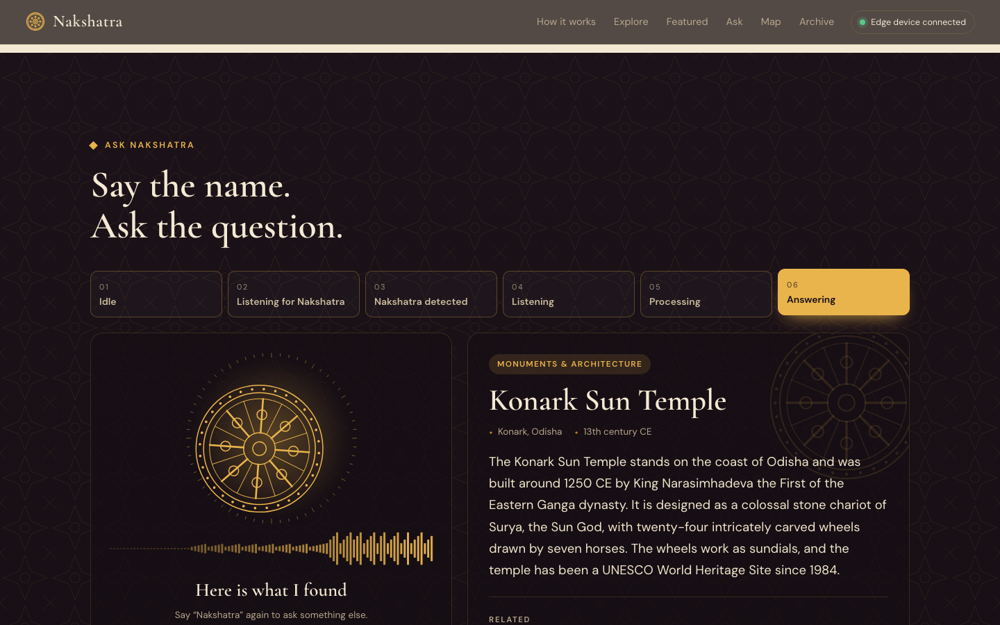
&nbsp;
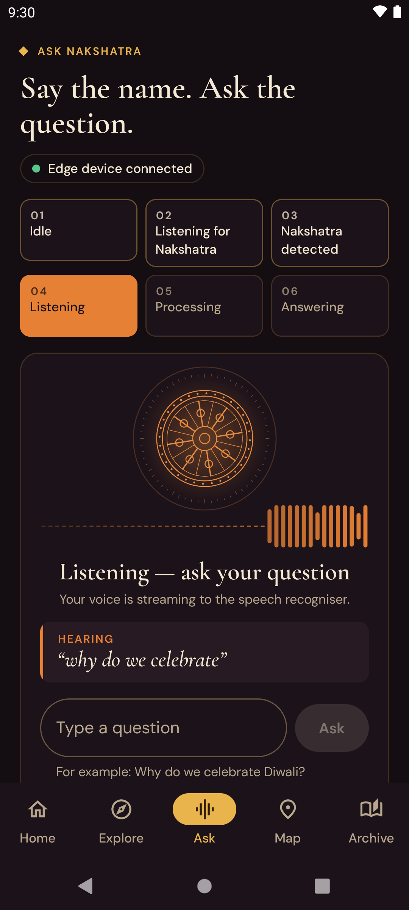

</div>

> Say **"Nakshatra"**, ask about a temple, a festival, a dance or a craft, and hear the answer.
> The wake word is recognised on an ESP32; only then is the question streamed to a server, transcribed and answered.

## Contents

[About](#about) · [Why Nakshatra?](#why-nakshatra) · [Key features](#key-features) · [Web platform](#web-platform) ·
[Android application](#android-application) · [Download Android app](#download-android-app) ·
[System architecture](#system-architecture) · [Technology stack](#technology-stack) · [Installation](#installation) ·
[API / Backend](#api--backend) · [Security](#security) · [Project structure](#project-structure) · [Team](#team) ·
[Future scope](#future-scope) · [Technical reference](#technical-reference)

## About

| | |
|---|---|
| **Project** | Nakshatra — Voice-Activated Cultural Heritage Companion |
| **PS ID** | SIH26214 |
| **Problem statement** | 214 — Cultural Heritage and Traditions of India |
| **Category** | Hardware |
| **Wake word** | "Nakshatra" |

India's heritage — monuments, festivals, classical and folk arts, crafts,
textiles, cuisine, yoga, ancient universities — is vast, regional and largely
passed on by word of mouth. Problem Statement 214 asks for that heritage to be
made accessible, engaging and accurate for anyone, including people who will
never type a search query.

Nakshatra is a small voice-activated device with two screens to go with it:

* An **ESP32** with an **INMP441** microphone listens for one word, locally,
  using a 44.8 kB neural network. Until it hears "Nakshatra" it sends no audio
  anywhere.
* After the wake word, the question is streamed over Wi-Fi to a server, turned
  into text by a streaming speech recogniser, and matched against a curated
  **knowledge base of 101 heritage topics**.
* The answer is shown and read aloud on the **website** and in the **Android
  app**. Both mirror every step of the pipeline live, and both let a visitor
  browse the archive by theme, by featured place and on a map.

## Why Nakshatra?

* Heritage information is scattered, text-heavy and screen-bound. In a museum
  gallery, a school corridor, a tourist kiosk or a village library, people want
  to *ask* and *listen*.
* Always-listening cloud assistants are costly, need constant connectivity and
  raise privacy concerns, because they stream everything they hear. Nakshatra
  transmits a single level reading while idle and audio only after its name.
* Generic assistants answer heritage questions inconsistently and cannot be
  curated by the institution that deploys them. Nakshatra answers from one
  reviewed JSON file, and says "that is not in my archive yet" rather than
  inventing an answer.

## Key features

| | |
|---|---|
| **On-device wake word** | DS-CNN-S, int8, 44,832 bytes, one inference every 100 ms on an ESP32 |
| **Zero idle audio** | Only an input-level number leaves the device until the wake word fires |
| **Streaming speech recognition** | Words appear on screen while you are still speaking |
| **Curated answers** | 101 topics, 363 listed phrasings, 15 themes, one spoken-length answer each |
| **Smart question matching** | By exact question, by name and alias, by description ("the festival of lights"), by keywords, and by sound for mis-heard names — with no external API |
| **No wrong answers** | Out-of-domain or badly mis-heard questions get "no match" |
| **Live interaction states** | Idle → Listening for Nakshatra → Nakshatra detected → Listening → Processing → Answering, on every connected screen at once |
| **Spoken answers** | Browser speech synthesis on the web, the device's text-to-speech on Android |
| **Explore without the hardware** | Typed questions, suggestion chips, 15 themed doors, 8 featured places, a searchable archive |
| **Heritage constellation** | 78 places plotted at their true latitude and longitude and joined like a star chart |
| **One source of truth** | One JSON file is the knowledge base; the server, the website, the Android app and this README's question list all come from it |
| **Self-checking** | Firmware parity tests, a 468-case answer-engine regression set, an end-to-end pipeline test, a browser test and 23 Android unit tests |

## Web platform

The website is served by the same Python process as the API. It is static HTML,
CSS and ES modules — no framework and no build step — and every section is
rendered from `GET /api/kb`. Illustrations are drawn in code, so it needs no
image files and works with no internet at the venue.

| Hero and live voice orb | Explore India |
|---|---|
| 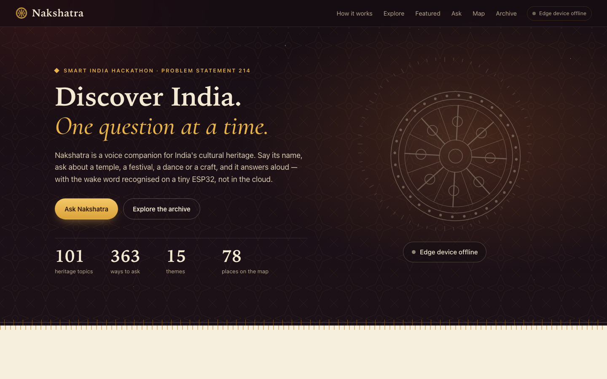 | 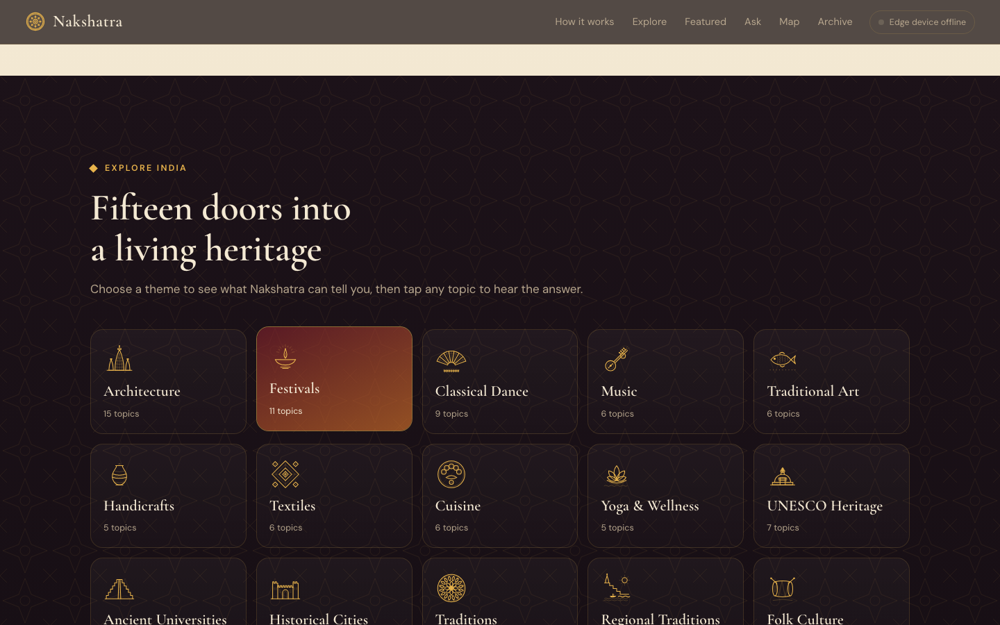 |
| **Listening** — the transcript appears as you speak | **Answering** — answer card, related topics, telemetry |
| 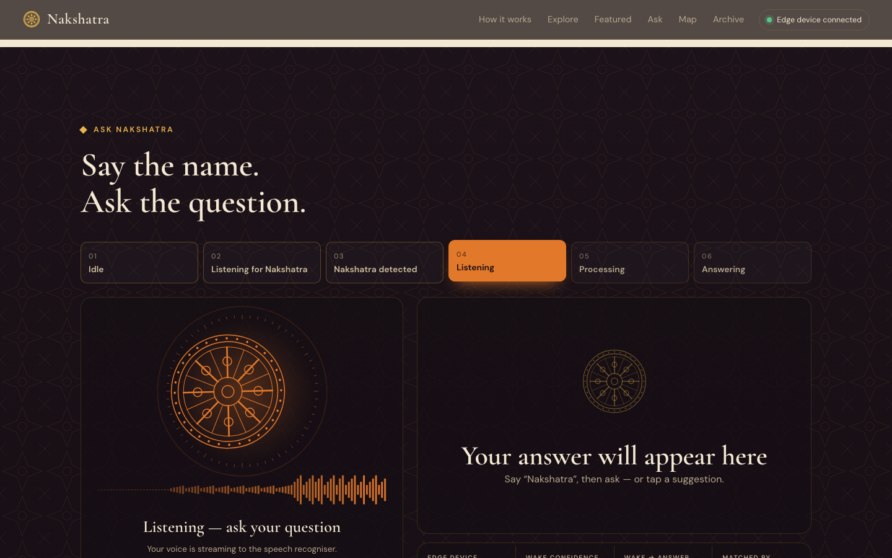 |  |
| **Heritage constellation** | **Archive** |
| 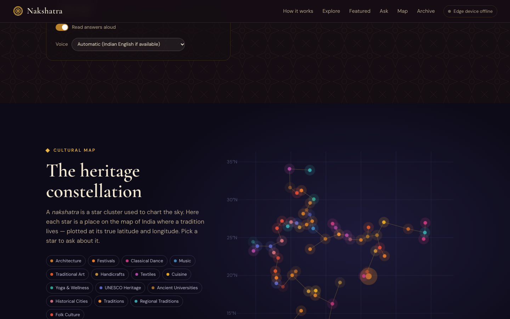 | 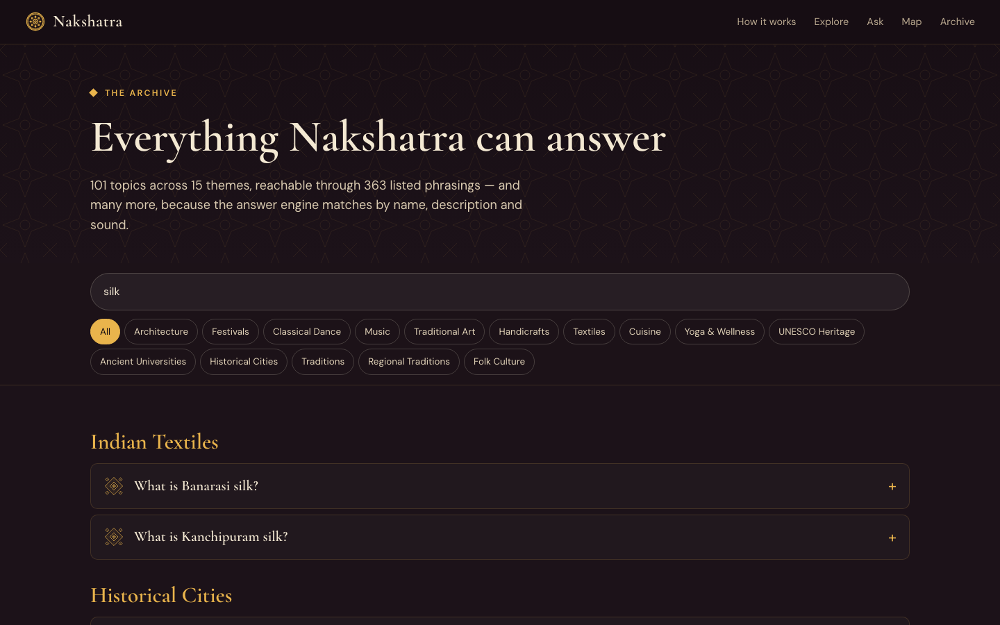 |

More: [featured heritage](assets/screenshots/03-featured.png) ·
[armed, waiting for the wake word](assets/screenshots/04-armed.png).
These images are produced by `tests/ui_check.py` driving the real site in headless Chrome.

## Android application

A native Android app — Kotlin, Jetpack Compose and Material 3, not a web view —
that is the mobile counterpart of the website. It has no content of its own:
it reads the archive, asks its questions and follows the voice pipeline on the
**same server and the same API** as the website.

| Screen | What it does |
|---|---|
| **Home** | The live voice orb and state, counts from the knowledge base, featured places, the themes, how the pipeline works |
| **Explore** | The fifteen themes; each opens its topics |
| **Topic** | The answer, place and era, read-aloud, every way to ask, related topics, a jump to the map |
| **Ask** | The six-state console: live waveform and transcript from the edge device, typed questions, the answer card, telemetry |
| **Map** | The heritage constellation with pinch-zoom, tap-to-select and a theme filter |
| **Archive** | Every topic with search and theme filter |
| **Settings** | Server address with a live status check, spoken answers, dark or light theme, about and team |

It follows the website's identity — the lamp-black, gold and saffron palette,
Cormorant Garamond and DM Sans, the per-theme gradients — and draws the same 22
line-art motifs, which are generated from the website's `art.js` so the two
cannot drift apart. It handles a missing server (clear error, retry, a saved
copy of the archive), rotation, tablets and landscape (navigation rail), and
both themes.

### Android screenshots

All taken from the release APK running on an emulator against the real server.
The "Listening" frame is a spoken question being streamed through the edge
protocol at that moment.

<table>
<tr>
<td align="center">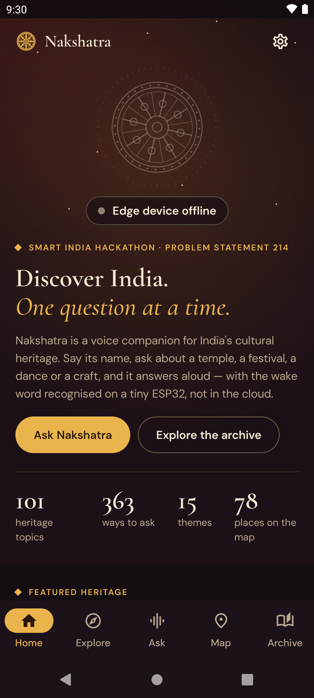<br><sub><b>Home</b> — live orb and archive counts</sub></td>
<td align="center">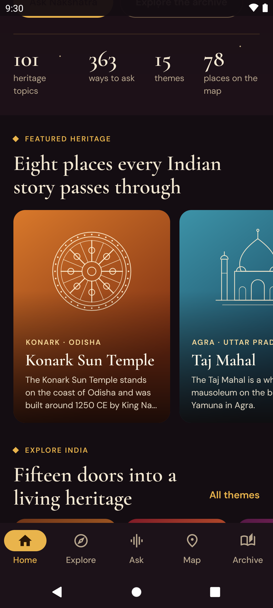<br><sub><b>Featured</b> — places and themes</sub></td>
<td align="center">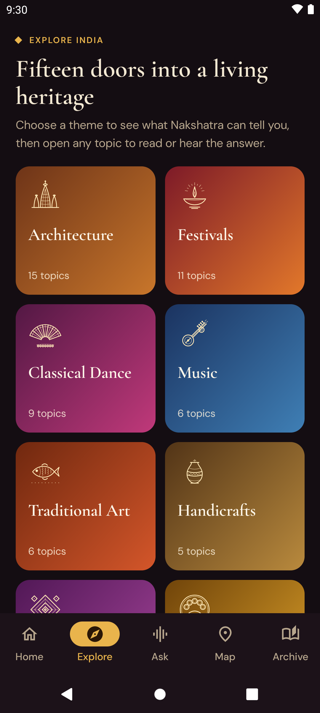<br><sub><b>Explore</b> — fifteen themes</sub></td>
<td align="center">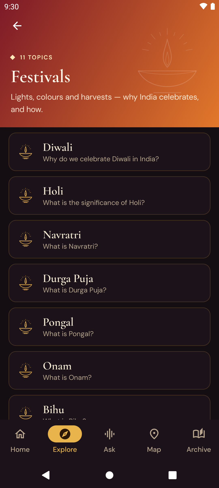<br><sub><b>Theme</b> — topics in Festivals</sub></td>
</tr>
<tr>
<td align="center">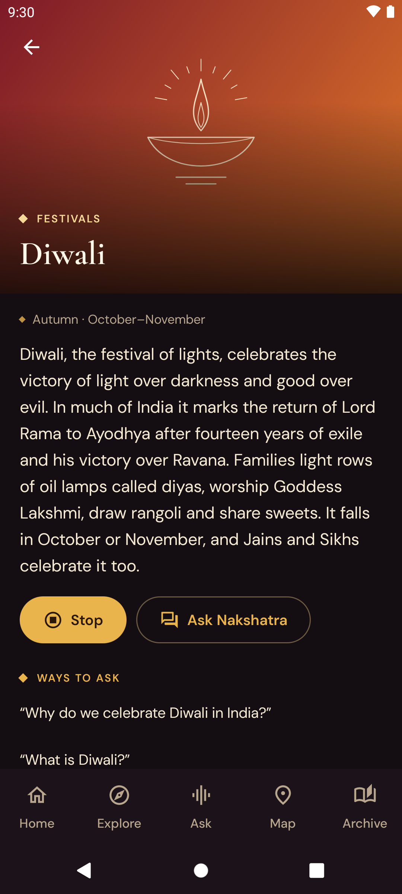<br><sub><b>Topic</b> — answer, read aloud, ways to ask</sub></td>
<td align="center"><br><sub><b>Ask</b> — hearing a spoken question live</sub></td>
<td align="center">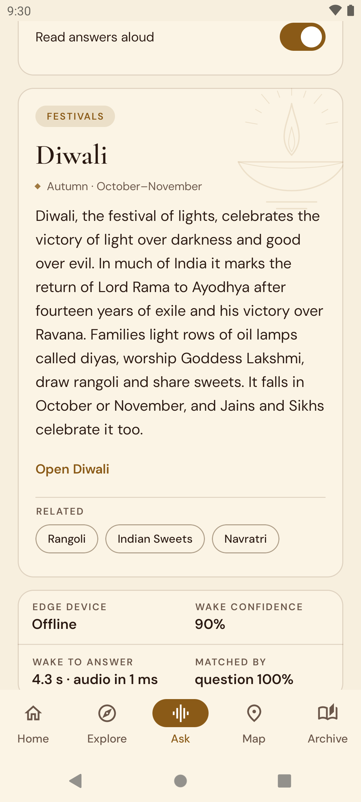<br><sub><b>Ask</b> — the answer, with pipeline telemetry (light theme)</sub></td>
<td align="center">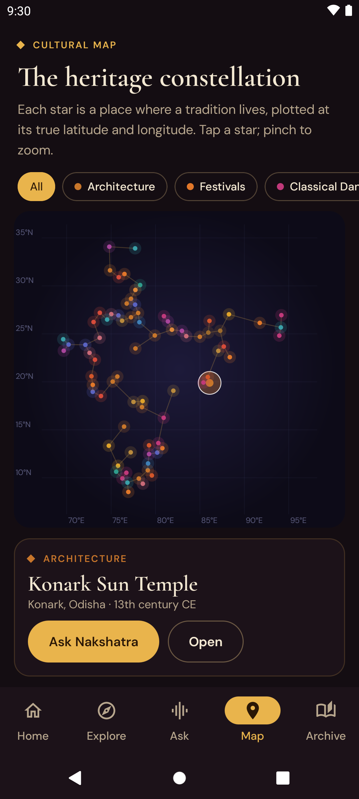<br><sub><b>Map</b> — the heritage constellation</sub></td>
</tr>
<tr>
<td align="center">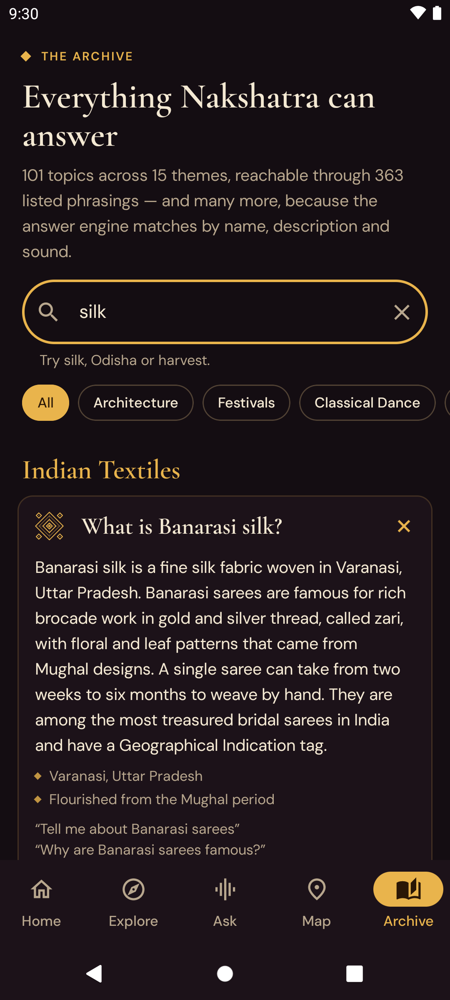<br><sub><b>Archive</b> — searching "silk"</sub></td>
<td align="center">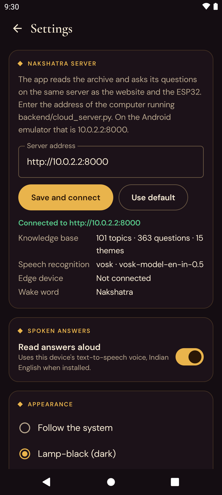<br><sub><b>Settings</b> — server status</sub></td>
<td align="center">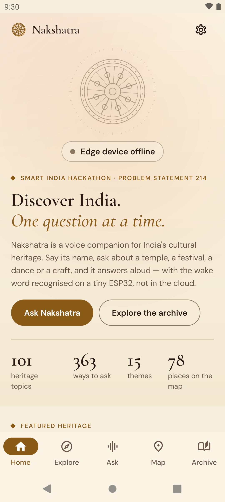<br><sub><b>Sandstone</b> — the light theme</sub></td>
<td></td>
</tr>
</table>

## Download Android app

**[nakshatra-v1.0.0.apk](https://github.com/ANMOLSCRIPT/nakshatra/releases/download/v1.0.0/nakshatra-v1.0.0.apk)**
from the [v1.0.0 release](https://github.com/ANMOLSCRIPT/nakshatra/releases/tag/v1.0.0)
(1.8 MB, Android 8.0 or newer).

The app is a client of the Nakshatra server, so it needs one to talk to:

1. Start the server on a computer (see [Installation](#installation)).
2. Put the phone on the same Wi-Fi, install the APK, open **Settings** (gear
   icon on Home) and enter the computer's address, e.g. `192.168.0.102:8000`.
3. On the Android emulator nothing needs setting: the default
   `http://10.0.2.2:8000` is the host computer.

## System architecture

```text
                              USER
                               │  "Nakshatra … why do we celebrate Diwali?"
                               ▼
                  ┌──────────────────────────┐
                  │  ESP32 + INMP441 mic     │  MFCC 49×10 → DS-CNN-S int8 (44.8 kB)
                  │  on-device wake word     │  fire: 3 of last 5 P(keyword) > 0.75
                  └────────────┬─────────────┘
                               │  Wi-Fi · WS /ws/edge
                               │  wake{t1,prob} → int16 PCM, 100 ms frames → utterance_end
                               ▼
        ┌───────────────────────────────────────────────────┐
        │  NAKSHATRA SERVER   backend/cloud_server.py       │
        │  FastAPI · one process · one port (8000)          │
        │                                                   │
        │   Vosk streaming ASR ──► answer engine            │
        │                          question → fuzzy →       │
        │                          descriptor → keywords →  │
        │                          phonetic                 │
        │                               │                   │
        │                 knowledge_base/heritage.json      │
        │                 101 topics · 15 themes            │
        └───────────────┬───────────────────────┬───────────┘
                        │                       │
        GET /api/kb · POST /api/ask · GET /api/health · WS /ws/ui
                        │                       │
                        ▼                       ▼
              ┌──────────────────┐    ┌──────────────────────┐
              │  WEBSITE         │    │  ANDROID APP         │
              │  HTML · CSS · JS │    │  Kotlin · Compose    │
              │  frontend/       │    │  android/            │
              └──────────────────┘    └──────────────────────┘
```

There is one backend and one knowledge base. The website and the Android app
are two clients of the same four endpoints; neither holds a copy of the content.
There is no database, no cloud service and no account system: the "database" is
`knowledge_base/heritage.json`, loaded by the server at start-up.
More detail: [docs/architecture.md](docs/architecture.md).

## Technology stack

| Layer | Technology |
|---|---|
| **Hardware** | ESP32-WROOM-32, INMP441 I²S MEMS microphone (16 kHz mono) |
| **Keyword spotting** | Python 3.11, TensorFlow 2.16 (training, int8 quantisation, TFLite), NumPy, SciPy; C arrays for TFLite Micro on the ESP32 |
| **Backend** | FastAPI, uvicorn, WebSockets — one process, one port |
| **Speech recognition** | Vosk (Kaldi), Indian-English models, run locally |
| **Answer engine** | rapidfuzz (fuzzy matching), jellyfish (metaphone); no external AI service |
| **Data** | One JSON file, `knowledge_base/heritage.json` |
| **Website** | HTML, CSS, vanilla JavaScript ES modules; Web Speech API for spoken answers |
| **Android** | Kotlin 2.2, Jetpack Compose, Material 3, Navigation Compose, ViewModel + StateFlow, Retrofit, OkHttp (REST + WebSocket), kotlinx.serialization, Coil, Android TextToSpeech |
| **Android build** | Android Gradle Plugin 9.1, Gradle 9.3.1, compile SDK 36, min SDK 26, R8 |
| **Tests** | Python scripts, gcc for firmware parity, headless Chrome via the DevTools Protocol, JUnit + MockWebServer + coroutines-test |
| **Infrastructure** | None beyond a laptop on the venue Wi-Fi: everything runs locally |

## Installation

### Server and website

Requires Python 3.11 or 3.12 (TensorFlow 2.16 has no wheels for newer versions).

```bash
python3.11 -m venv .venv
source .venv/bin/activate              # Windows: .venv\Scripts\activate
pip install -r requirements.txt        # server + edge agent + KWS pipeline
scripts/download_asr_model.sh          # large Indian-English ASR model (~1 GB)
#   or: scripts/download_asr_model.sh small   (36 MB, low accuracy on heritage names)
```

Server only (no TensorFlow, no microphone): `pip install -r backend/requirements.txt`.

```bash
# terminal 1 — server (ASR + answer engine + website + API)
python backend/cloud_server.py

# terminal 2 — edge device stand-in (laptop microphone + the real keyword model)
python hardware/edge_agent.py --list-devices
python hardware/edge_agent.py --device <idx>
```

Open <http://localhost:8000>, say **"Nakshatra"**, wait for "Listening", and ask.
The archive is at `/library.html`; from another device use `http://<server-ip>:8000`.
Without any edge device the site is still fully usable: type a question, tap a
suggestion, a theme topic, a featured card or a star on the map.

### Android app

1. Start the server as above.
2. Open the `android/` folder in Android Studio (2025.3 or newer) and let Gradle sync.
3. Pick an emulator or a phone with USB debugging and press **Run**.

Or from a terminal:

```bash
cd android
./gradlew installDebug                 # build and install on the running emulator / phone
./gradlew assembleRelease              # app/build/outputs/apk/release/app-release.apk
./gradlew test lint                    # unit tests and Android lint
```

The emulator reaches the server at `http://10.0.2.2:8000` with no configuration.
On a phone, set the computer's address in the app's Settings.
Details: [android/README.md](android/README.md).

## API / Backend

One server, used unchanged by the website, the Android app and the edge device.
It needs no key and has no accounts.

| Endpoint | Used by | Purpose |
|---|---|---|
| `GET /api/kb` | website, Android | `meta`, `categories`, `topics` — the whole knowledge base |
| `POST /api/ask` | website, Android | `{"question": "..."}` → `{question, match, match_ms}`; the same answer engine the voice path uses |
| `GET /api/health` | website, Android | wake word, edge connection, ASR model, knowledge-base counts |
| `WS /ws/ui` | website, Android | live broadcast: `edge_status`, `level`, `wake`, `partial`, `final_segment`, `transcript`, `content` |
| `WS /ws/edge` | ESP32 / `edge_agent.py` | `level`, `wake`, binary PCM, `utterance_end` |
| `GET /` | browsers | the website |

`content.match` and `/api/ask`'s `match` are the same object: the full topic
(with `answer`), plus `category_name`, `related`, `confidence` and
`matched_by`; `null` when nothing fits.

```bash
curl -s localhost:8000/api/ask -H 'content-type: application/json' \
     -d '{"question":"Give me information about Konark"}'
```

The edge contract is specified byte-for-byte in [hardware/PROTOCOL.md](hardware/PROTOCOL.md).

## Security

* **No secrets exist in this project.** The API takes no key, there is no
  database password and no cloud account. Nothing secret is in the repository
  or in the APK; the release APK was unpacked and scanned to confirm it
  ([reports/apk_validation.md](reports/apk_validation.md)).
* `.env` files, keystores and `keystore.properties` are git-ignored;
  [`.env.example`](.env.example) and
  [`android/keystore.properties.example`](android/keystore.properties.example)
  hold placeholders only.
* The server is a **local-network service** with no authentication and plain
  HTTP. Run it on a trusted network (the demo laptop's Wi-Fi), not on the open
  internet. The Android app therefore permits cleartext traffic; it sends no
  credentials or personal data — only the text of a heritage question.
* The app requests one permission, `INTERNET`, exports only its launcher
  activity, disables backup and is shrunk with R8.
* Privacy by design on the device: no audio leaves the ESP32 until the wake
  word is detected on it.

Full review: [reports/android_security_audit.md](reports/android_security_audit.md).

## Project structure

```
.
├── README.md
├── requirements.txt              everything, for a one-machine demo
├── .env.example                  placeholder only — the project needs no secrets
├── knowledge_base/
│   └── heritage.json             the content: 15 categories, 101 topics
├── backend/                      FastAPI server, Vosk ASR, answer engine, tests
├── frontend/                     the website: index.html, library.html, css/, js/
├── android/                      the native Android app (Kotlin, Jetpack Compose)
│   ├── app/src/main/java/com/nakshatra/heritage/
│   │   ├── data/                 API models, Retrofit + WebSocket client, repository
│   │   ├── voice/                the interaction state machine, spoken answers
│   │   └── ui/                   theme, line art, screens, navigation
│   └── app/src/test/             JVM unit tests
├── hardware/                     edge device: KWS pipeline, model, firmware bundle, protocol (voice recordings not published)
├── docs/
│   ├── architecture.md
│   └── images/                   Android screenshots
├── assets/screenshots/           website screenshots (generated by tests/ui_check.py)
├── reports/                      project audit, security audit, APK validation
├── scripts/
│   ├── download_asr_model.sh
│   ├── validate_kb.py
│   ├── build_readme_qa.py
│   ├── export_android_motifs.mjs website line art → Android
│   └── run_tests.sh
├── tests/
│   ├── e2e_pipeline.py           wake-word recording → real KWS → server → ASR → answer
│   ├── ui_check.py               the website in headless Chrome
│   └── asr_eval.py               spoken-question accuracy
├── submission/                   presentation and demo-video placeholders
├── SUBMISSION_GUIDE.md
└── LICENSE
```

## Team

| Member | Role |
|---|---|
| Radhika Chopra | Embedded |
| Shireen Sandilya | Embedded |
| Ansh Jayara | Embedded |
| Kavyansh Malhotra | ML |
| Anmol Garg | Embedded / Cloud |
| Harshit Sharma | Cloud / ML |

## Future scope

* Publish the ESP32 firmware source alongside the bundle, with on-device clock sync so latency figures exclude clock skew.
* Hindi and other Indian-language questions and answers (multilingual ASR and a translated knowledge base).
* Add recogniser mis-hearings from real visitors (`backend/logs/unmatched.jsonl`) as aliases; evaluate a stronger ASR model for rare proper nouns.
* A speaker on the device itself, so the answer is spoken without a screen.
* Follow-up questions ("who built it?") by remembering the last topic.
* Openly licensed photographs and audio samples (ragas, instruments) on topic cards; both clients already show a topic's `image` when it has one.
* A microphone button in the Android app, so a phone can ask by voice where no edge device is installed.
* Server discovery on the local network (mDNS) and HTTPS, so the app needs no typed address.
* More topics per state, and a curator's editing page for institutions.
* Several edge devices at once (the server is single-device today).

---

# Technical reference

The sections below document each part of the system in depth.

## The Nakshatra KWS system

Unchanged from the original build — not retrained, not re-tuned.

| | |
|---|---|
| Wake word | **Nakshatra** (`N AH K SH AA T R AH`) |
| Model | DS-CNN-S (depthwise-separable CNN), `nakshatra_v5`, int8 TFLite, **44,832 bytes** |
| Input | `[1, 49, 10, 1]` int8 MFCC, scale 0.448253, zero-point 67 |
| Output | `[1, 3]` int8 = `[silence, unknown, keyword]`, scale 0.145795, zero-point 2 |
| Detection | every 100 ms; fire when ≥ 3 of the last 5 softmax keyword probabilities exceed 0.75; 1 s refractory |
| Held-out performance | TPR 89.8 %, hard-negative TNR 96.7 %, 0 false triggers in 300 s of talking |
| Dataset | 579 positive, 270 hard-negative and 8 ambient recordings across sessions and microphones, plus earlier takes (`positives/`, `hard_neg/`, `raw_sessions/`) and background audio. The audio is the team's own voices and is not published in this repository; the trained model and firmware bundle built from it are |
| Hard negatives | deliberately confusable words such as *natak*, *nakli*, *lakshan*, *raksha*, *kshatriya* |
| Contract hash | `eaec172cd4689c14` — stamped on the checkpoint and every exported header |

Files: `hardware/kws/` (pipeline), `hardware/kws/artifacts/checkpoints/nakshatra_v5/`
(model), `hardware/firmware_handoff/` (firmware bundle). See
[hardware/kws/README.md](hardware/kws/README.md) and
[hardware/firmware_handoff/MANIFEST.md](hardware/firmware_handoff/MANIFEST.md).

## Audio pipeline

```text
INMP441 ─I²S─► 16 kHz mono int16
   │
   ├─ IDLE: 1 s sliding window, hop 100 ms (1600 samples)
   │     x = pcm / 32768 → pre-emphasis 0.97 → 49 frames of 640 samples, hop 320
   │     → symmetric Hann → zero-pad to 1024 → |FFT|² (513 bins)
   │     → 40 mel bands (20–4000 Hz) → ln(x + 1e-6) → DCT-II → 10 MFCCs
   │     → quantise to int8 → DS-CNN-S → softmax → P(keyword)
   │     → k-of-window detector (3 of 5 > 0.75, 1 s refractory)
   │     + every 200 ms: {"event":"level","rms":…}
   │
   └─ STREAMING (after a detection):
         {"event":"wake","t1":…,"prob":…}
         3 pre-roll frames (the 300 ms before the detection)
         live frames: 1600 samples = 3200 bytes = 100 ms, raw int16 LE
         stop after 1.5 s of silence (RMS < 0.02) or 8 s
         {"event":"utterance_end"} → back to IDLE
```

If the connection drops, the device keeps running and buffers about 10 s of
messages (drop-oldest), reconnecting with 2 → 10 s exponential backoff. The
full contract is [hardware/PROTOCOL.md](hardware/PROTOCOL.md).

## ASR pipeline

* **Engine**: Vosk, one `KaldiRecognizer` per utterance, created on `wake` and
  fed each 100 ms frame on a worker thread so the socket never blocks.
* **Streaming**: every changed partial hypothesis is broadcast (`partial`);
  segments Vosk finalises mid-utterance are broadcast (`final_segment`) and
  accumulated, so the final `transcript` is the whole utterance.
* **Model choice — the one component that had to change.** The original server
  used `vosk-model-small-en-in-0.4`. That model's vocabulary does not contain
  most heritage proper nouns (not even "Diwali" or "Holi"), so it cannot
  transcribe them. This project therefore prefers the large Indian-English
  model `vosk-model-en-in-0.5` when it is installed and falls back to the small
  one. Same engine, same code path, same protocol; only the model directory differs.

  Measured with `tests/asr_eval.py` — each topic's primary question synthesised
  with a text-to-speech voice and pushed through the server's recogniser and
  answer engine (101 questions):

  | ASR model | Voice | Vocabulary bias | Answered correctly | Answered wrongly | "No match" |
  |---|---|---|---|---|---|
  | `vosk-model-en-in-0.5` (default) | Indian English (Rishi) | off (default) | **68 / 101 (67 %)** | 0 | 33 |
  | `vosk-model-en-in-0.5` | Indian English (Rishi) | on | 69 / 101 (68 %) | 0 | 32 |
  | `vosk-model-en-in-0.5` | US English (Samantha) | off | 49 / 101 (49 %) | 3 | 49 |
  | `vosk-model-small-en-in-0.4` | Indian English (Rishi) | off | 24 / 101 (24 %) | 3 | 74 |
  | `vosk-model-small-en-in-0.4` | Indian English (Rishi) | on | 27 / 101 (27 %) | 14 | 60 |

  These use synthetic speech, which is cleaner than a microphone but
  pronounces Indian names imperfectly; treat them as a comparison between
  configurations, not as field accuracy. Questions that fail are mostly rare
  proper nouns ("Mohiniyattam", "Dholavira", "Bidriware"). Descriptive
  phrasings ("the festival of lights", "the classical dance of Kerala") are
  recognised far more reliably than rare names, which is why every topic
  carries descriptors.
* **Vocabulary bias** (`--vocab-bias`) constrains the recogniser to the
  knowledge base's word list. It is **off by default**: with the small model it
  forces unknown names into the nearest listed word and produced 14 wrong
  answers out of 101; with the large model it makes no meaningful difference.
* **Learning from real voices**: every spoken question that finds no answer is
  appended to `backend/logs/unmatched.jsonl`. Add what the recogniser actually
  heard to that topic's `aliases` in the knowledge base and it will match next time.
* Cost of the large model: about 1 GB download, 1.5 GB on disk, roughly 1.7 GB of RAM.

## Knowledge-base architecture

`knowledge_base/heritage.json` is the single source of content.

```json
{
  "meta":       { "title": "...", "domain": "...", "version": "1.0.0" },
  "categories": [ { "id": "festivals", "name": "Festivals", "short": "Festivals",
                    "motif": "lamp", "blurb": "..." } ],
  "topics": [
    {
      "id": "konark-sun-temple",
      "category": "monuments",
      "name": "Konark Sun Temple",
      "question": "Tell me about Konark Temple",
      "alternative_questions": ["What is the history of Konark Sun Temple?", "Why is the Konark Sun Temple famous?", "Give me information about Konark"],
      "aliases": ["Konark", "Konark Temple", "Konarak", "Sun Temple", "Black Pagoda"],
      "descriptors": ["sun temple", "temple shaped like a chariot", "chariot of the sun god"],
      "keywords": ["konark", "surya", "chariot", "wheels", "odisha"],
      "answer": "The Konark Sun Temple stands on the coast of Odisha ...",
      "related_topics": ["odissi", "pattachitra", "unesco-sites-india"],
      "location": { "place": "Konark", "state": "Odisha", "lat": 19.8876, "lon": 86.0945 },
      "era": "13th century CE",
      "featured": true,
      "motif": "wheel"
    }
  ]
}
```

| Field | Used for |
|---|---|
| `question`, `alternative_questions` | exact-question matching, fuzzy matching, the archive page, this README |
| `name`, `aliases` | fuzzy and phonetic matching (include spellings and what the recogniser tends to hear) |
| `descriptors` | plain-English phrases of 2+ words for people who describe rather than name |
| `keywords` | weak evidence; two or more must be present |
| `answer` | shown and spoken; 35–85 words, never contains the wake word |
| `related_topics` | chips on the answer card |
| `location`, `era` | the map, card metadata |
| `featured`, `motif`, `image` | featured cards and illustrations |

**Editing workflow**

```bash
# edit knowledge_base/heritage.json, then:
python scripts/validate_kb.py        # ids, categories, links, duplicate descriptors, answer length
python backend/test_matcher.py       # every listed question must still resolve to its own topic
python scripts/build_readme_qa.py    # regenerate section 22 of this README
```

### How a question is matched (`backend/heritage_matcher.py`)

Filler words are removed first ("tell me about", "what is", "why is … famous").
Then, in order of precedence:

| Layer | Evidence | Example |
|---|---|---|
| `question` | the remaining words equal a listed question | "What is Rani ki Vav?" |
| `fuzzy` (strong) | a name, alias or question is contained in what was said | "Give me information about **Konark**" |
| `descriptor` | an exact multi-word description | "the **festival of lights**" → Diwali |
| `fuzzy` (weak) | partial overlap covering most of the query | "tell me about **konarak** sun tempel" |
| `keywords` | two or more keywords | "white **marble** tomb in **Agra**" → Taj Mahal |
| `phonetic` | sounds or is spelt almost like a name | "**bharat natyam**", "**katha kali**" |

Safeguards: generic words ("temple", "festival", "dance") can never carry a
match alone; among candidates the one explaining more of the question wins
("difference … Hindustani … Carnatic" beats plain "Hindustani"); a word that
belongs to several topics ("Kerala") is never used to guess; out-of-domain
questions return no match.

## Website architecture

```
frontend/
├── index.html          hero · how it works · explore · featured · ask · map · footer
├── library.html        the archive: every question and answer, searchable
├── css/styles.css      design tokens, layout, state-driven animation
├── js/
│   ├── api.js          REST + /ws/ui client with reconnect
│   ├── voice.js        the interaction state machine and spoken answers
│   ├── main.js         renders every section from /api/kb
│   ├── map.js          heritage constellation (projection, spanning tree, filter)
│   ├── art.js          procedural line art: 22 motifs + the voice orb
│   └── library.js      archive page
└── assets/             favicon; optional photographs (assets/heritage/README.md)
```

* **One state attribute drives the page.** `voice.js` writes the current state
  to `<html data-voice="…">`; CSS animates both orbs, the status pills, the
  six-step indicator and the pipeline diagram from that single attribute.
* **Nothing is simulated.** States change only on real `/ws/ui` events or on
  the reply to a typed question. The waveform is the real input level: from
  the device while idle, computed by the server from the incoming audio while
  streaming.
* **No images required.** Every illustration is drawn in code, so the site
  works offline and carries no image-licensing risk. A topic can opt into a
  photograph through its `image` field.
* **The map draws no political boundary.** Places are plotted at their true
  coordinates and joined like a star chart; the outline of India emerges from
  where its heritage lives.

## Backend architecture

```
backend/
├── cloud_server.py       FastAPI app: /ws/edge, /ws/ui, /api/*, static website
├── heritage_matcher.py   the answer engine
├── test_matcher.py       answer-engine regression set
├── test_edge_sim.py      replay a WAV file as an edge device
├── requirements.txt
├── models/vosk/          ASR models (downloaded, not in git)
└── logs/unmatched.jsonl  spoken questions that found no answer (created at run time)
```

One process, one port (8000). A single edge device is served at a time. ASR
runs on a thread pool; everything else is asyncio.

## Connecting the ESP32

Summary (full procedure in [hardware/README.md](hardware/README.md)):

1. Wire the INMP441: VDD → 3V3, GND → GND, L/R → GND, SCK → GPIO 32, WS → GPIO 25, SD → GPIO 33 (or any free pins, set in firmware).
2. Build the firmware from `hardware/firmware_handoff/` and pass its parity and go/no-go tests.
3. Put the ESP32 and the server on the same Wi-Fi; the firmware opens `ws://<server-ip>:8000/ws/edge`.
4. Stop `edge_agent.py` first — one edge device at a time.
5. The website's status pill shows "Edge device connected".

## Server options

The ASR runs inside `cloud_server.py`; there is no separate process.

```bash
python backend/cloud_server.py                                   # large model if installed, else small
python backend/cloud_server.py --vosk-model vosk-model-small-en-in-0.4
python backend/cloud_server.py --vosk-model /path/to/any/vosk-model
python backend/cloud_server.py --vocab-bias                      # small model only
python backend/cloud_server.py --host 127.0.0.1 --port 9000
curl localhost:8000/api/health                                   # confirms which model is loaded
```

If no model is found the server still starts and typed questions work; voice
questions return an empty transcript.

## Questions Nakshatra can answer

This section is generated from `knowledge_base/heritage.json` by
`scripts/build_readme_qa.py`; it lists every supported question with the exact
answer Nakshatra gives. (Sections 22 and 23 of the documentation checklist —
the supported questions and the answers provided — are combined here.)

<!-- QA:BEGIN (generated by scripts/build_readme_qa.py -- do not edit by hand) -->

**101 topics · 363 listed phrasings · 15 categories.** Each topic has one spoken answer. The first question under a topic is the primary phrasing; the others are listed alternatives. Because matching is by name, description and sound, many unlisted wordings work too ("Give me information about Konark", "the festival of lights").

### Monuments & Architecture (15)

**1. Konark Sun Temple** &nbsp;`konark-sun-temple`

- “Tell me about Konark Temple”
- “What is the history of Konark Sun Temple?”
- “Why is the Konark Sun Temple famous?”
- “Give me information about Konark”
- *also understood when described as:* sun temple, temple shaped like a chariot, chariot of the sun god, black pagoda, stone wheels temple

> The Konark Sun Temple stands on the coast of Odisha and was built around 1250 CE by King Narasimhadeva the First of the Eastern Ganga dynasty. It is designed as a colossal stone chariot of Surya, the Sun God, with twenty-four intricately carved wheels drawn by seven horses. The wheels work as sundials, and the temple has been a UNESCO World Heritage Site since 1984.

**2. Taj Mahal** &nbsp;`taj-mahal`

- “Tell me about the Taj Mahal”
- “Who built the Taj Mahal?”
- “Why is the Taj Mahal famous?”
- “What is the history of the Taj Mahal?”
- *also understood when described as:* monument of love, white marble mausoleum, tomb of mumtaz mahal, marble tomb in agra

> The Taj Mahal is a white marble mausoleum on the banks of the Yamuna in Agra. The Mughal emperor Shah Jahan built it in memory of his wife Mumtaz Mahal; work began in 1632 and the complex took about twenty years to finish. Famous for its perfect symmetry and delicate stone inlay, it is a UNESCO World Heritage Site and a lasting symbol of love.

**3. Hampi** &nbsp;`hampi`

- “What is special about Hampi?”
- “Tell me about Hampi”
- “What is the history of Hampi?”
- “Why is Hampi famous?”
- *also understood when described as:* capital of the vijayanagara empire, stone chariot, musical pillars, ruins in karnataka

> Hampi, in Karnataka, was the capital of the Vijayanagara Empire from the fourteenth to the sixteenth century and one of the richest cities of its time. Its ruins spread along the Tungabhadra river among giant boulders. Highlights include the Virupaksha Temple, still in worship, and the Vittala Temple with its stone chariot and musical pillars. Hampi is a UNESCO World Heritage Site.

**4. Ajanta Caves** &nbsp;`ajanta-caves`

- “Tell me about the Ajanta Caves”
- “What are the Ajanta Caves famous for?”
- “What is the history of Ajanta?”
- “Where are the Ajanta Caves?”
- *also understood when described as:* buddhist cave paintings, painted buddhist caves, cave murals of maharashtra

> The Ajanta Caves are about thirty rock-cut Buddhist caves carved into a horseshoe-shaped cliff in Maharashtra, created between the second century BCE and about 480 CE. They are celebrated for their murals and sculptures, which show the life of the Buddha and the Jataka tales and rank among the finest surviving ancient Indian paintings. Forgotten for centuries, they were rediscovered in 1819.

**5. Ellora Caves** &nbsp;`ellora-caves`

- “What are the Ellora Caves?”
- “Tell me about the Ellora Caves”
- “Why are the Ellora Caves famous?”
- “What is the Kailasa Temple?”
- *also understood when described as:* temple carved from a single rock, buddhist hindu and jain caves, rock cut temple, carved out of one rock

> The Ellora Caves in Maharashtra are a group of thirty-four rock-cut monasteries and temples made between about 600 and 1000 CE. Buddhist, Hindu and Jain caves stand side by side, reflecting India's tradition of religious harmony. The masterpiece is the Kailasa Temple, carved top-down out of a single rock under the Rashtrakuta king Krishna the First. Ellora is a UNESCO World Heritage Site.

**6. Sanchi Stupa** &nbsp;`sanchi-stupa`

- “What is the significance of Sanchi Stupa?”
- “Tell me about Sanchi Stupa”
- “Who built the Sanchi Stupa?”
- “What is the Great Stupa?”
- *also understood when described as:* great stupa, stupa built by ashoka, buddhist stupa, oldest stone structure

> The Great Stupa at Sanchi in Madhya Pradesh is one of the oldest stone structures in India. Emperor Ashoka commissioned it in the third century BCE to house relics of the Buddha. Its hemispherical dome symbolises the universe, and its four ornate gateways, called toranas, are carved with scenes from the Buddha's life. Sanchi is a UNESCO World Heritage Site.

**7. Red Fort** &nbsp;`red-fort`

- “What is the Red Fort?”
- “Tell me about the Red Fort”
- “Who built the Red Fort?”
- “Why is the Red Fort important?”
- *also understood when described as:* red fort, fort in delhi, where the prime minister hoists the flag

> The Red Fort in Delhi was built by the Mughal emperor Shah Jahan and completed in 1648 as the palace fort of his new capital, Shahjahanabad. Named for its massive red sandstone walls, it was the seat of the Mughal emperors for nearly two hundred years. Every Independence Day, the Prime Minister hoists the national flag here. It is a UNESCO World Heritage Site.

**8. Qutub Minar** &nbsp;`qutub-minar`

- “Tell me about the Qutub Minar”
- “How tall is the Qutub Minar?”
- “Who built the Qutub Minar?”
- “What is the Qutb Minar?”
- *also understood when described as:* tallest brick minaret, tall tower in delhi, iron pillar, victory tower in delhi

> The Qutub Minar in Delhi is the tallest brick minaret in the world, rising about seventy-three metres in five tapering storeys. Qutb-ud-din Aibak began it around 1199, and his successor Iltutmish completed it. Its surface is covered with carved bands of calligraphy. In the same complex stands the famous Iron Pillar, which has resisted rust for about sixteen hundred years.

**9. Fatehpur Sikri** &nbsp;`fatehpur-sikri`

- “What is Fatehpur Sikri?”
- “Tell me about Fatehpur Sikri”
- “Who built Fatehpur Sikri?”
- “What is the Buland Darwaza?”
- *also understood when described as:* city of victory, abandoned mughal capital, capital built by akbar, city built by akbar

> Fatehpur Sikri, near Agra, is a royal city built by the Mughal emperor Akbar, who founded it in 1571 and made it his capital for about fourteen years. Built of red sandstone, it blends Persian and Indian styles. Its landmarks include the towering Buland Darwaza, the Panch Mahal and the tomb of the Sufi saint Salim Chishti. It is a UNESCO World Heritage Site.

**10. Khajuraho Temples** &nbsp;`khajuraho`

- “Tell me about the Khajuraho temples”
- “What is Khajuraho famous for?”
- “Who built the Khajuraho temples?”
- *also understood when described as:* temples built by the chandelas, chandela temples, temples of madhya pradesh with sculptures

> The Khajuraho temples in Madhya Pradesh were built by the Chandela dynasty between about 950 and 1050 CE. Of the original eighty-five temples, around twenty-five survive, dedicated to Hindu and Jain traditions. They are masterpieces of the Nagara style, with soaring spires and walls covered in sculptures of gods, dancers, musicians and everyday life. Khajuraho is a UNESCO World Heritage Site.

**11. Brihadeeswara Temple** &nbsp;`brihadeeswara-temple`

- “Tell me about the Brihadeeswara Temple”
- “What is the Big Temple of Thanjavur?”
- “Who built the Brihadeeswara Temple?”
- “What are the Great Living Chola Temples?”
- *also understood when described as:* big temple, temple built by raja raja chola, great living chola temples, granite temple of thanjavur

> The Brihadeeswara Temple in Thanjavur, Tamil Nadu, was built by the Chola emperor Raja Raja Chola the First and completed in 1010 CE. Dedicated to Shiva and built entirely of granite, its tower rises about sixty-six metres and is crowned by a capstone weighing around eighty tonnes. It is part of the Great Living Chola Temples, a UNESCO World Heritage Site.

**12. Meenakshi Temple** &nbsp;`meenakshi-temple`

- “Tell me about the Meenakshi Temple”
- “What is the Meenakshi Amman Temple?”
- “Why is the Meenakshi Temple famous?”
- *also understood when described as:* temple with colourful towers, temple of madurai, hall of a thousand pillars

> The Meenakshi Amman Temple in Madurai, Tamil Nadu, is dedicated to the goddess Meenakshi and her consort Sundareswarar, a form of Shiva. Most of the present temple was built by the Nayak rulers in the sixteenth and seventeenth centuries. It is famous for its fourteen towering gateways, or gopurams, covered with thousands of brightly painted figures, and for its Hall of a Thousand Pillars.

**13. Golden Temple** &nbsp;`golden-temple`

- “Tell me about the Golden Temple”
- “What is Harmandir Sahib?”
- “Why is the Golden Temple important?”
- “What is the langar at the Golden Temple?”
- *also understood when described as:* golden temple, holiest sikh shrine, sikh temple in amritsar, largest free kitchen

> The Golden Temple, or Harmandir Sahib, in Amritsar, Punjab, is the holiest shrine of Sikhism. Completed in 1604 under Guru Arjan, it sits in the middle of a sacred pool and was later covered in gold by Maharaja Ranjit Singh. Its four entrances welcome people of every faith, and its langar, a free community kitchen, serves meals to tens of thousands of visitors every day.

**14. Mahabodhi Temple** &nbsp;`mahabodhi-temple`

- “What is the Mahabodhi Temple?”
- “Tell me about the Mahabodhi Temple”
- “Where did the Buddha attain enlightenment?”
- “What is Bodh Gaya?”
- *also understood when described as:* where buddha attained enlightenment, buddha attained enlightenment, bodhi tree, place of enlightenment

> The Mahabodhi Temple at Bodh Gaya in Bihar marks the place where Prince Siddhartha attained enlightenment under the Bodhi tree and became the Buddha. Emperor Ashoka built the first shrine here in the third century BCE; the present brick temple dates from about the fifth or sixth century CE. It is one of the holiest sites of Buddhism and a UNESCO World Heritage Site.

**15. Charminar** &nbsp;`charminar`

- “Tell me about the Charminar”
- “What is the Charminar?”
- “Who built the Charminar?”
- *also understood when described as:* four minarets, monument with four towers, symbol of hyderabad

> The Charminar is the best-known landmark of Hyderabad in Telangana. Sultan Muhammad Quli Qutb Shah built it in 1591 when he founded the city. Its name means four minarets, after the four graceful towers at its corners, and it has a mosque on the top floor. The bustling bazaars around it are famous for bangles, pearls and Hyderabadi food.

### Festivals (11)

**16. Diwali** &nbsp;`diwali`

- “Why do we celebrate Diwali in India?”
- “What is Diwali?”
- “Tell me about Diwali”
- “What is the festival of lights?”
- *also understood when described as:* festival of lights, festival of lamps, return of rama to ayodhya

> Diwali, the festival of lights, celebrates the victory of light over darkness and good over evil. In much of India it marks the return of Lord Rama to Ayodhya after fourteen years of exile and his victory over Ravana. Families light rows of oil lamps called diyas, worship Goddess Lakshmi, draw rangoli and share sweets. It falls in October or November, and Jains and Sikhs celebrate it too.

**17. Holi** &nbsp;`holi`

- “What is the significance of Holi?”
- “Why do we celebrate Holi?”
- “Tell me about Holi”
- “What is the festival of colours?”
- *also understood when described as:* festival of colours, festival of colors, festival of spring colours, throwing colours

> Holi is the festival of colours, celebrated in March to welcome spring. It begins with Holika Dahan, a bonfire recalling how the devotee Prahlada was saved while the demoness Holika burned, a sign of good defeating evil. The next day people play with coloured powder and water, a custom linked to Krishna and Radha. Holi is a time to forgive, mend friendships and celebrate together.

**18. Navratri** &nbsp;`navratri`

- “What is Navratri?”
- “Why is Navratri celebrated?”
- “Tell me about Navratri”
- “What is Dussehra?”
- *also understood when described as:* nine nights festival, festival of nine nights, nine forms of durga

> Navratri means nine nights. It is a festival dedicated to Goddess Durga, whose nine forms are worshipped on nine successive nights, usually in September or October. People fast, pray and, especially in Gujarat, dance Garba and Dandiya late into the night. The tenth day is Dussehra, or Vijayadashami, which celebrates the victory of good over evil.

**19. Durga Puja** &nbsp;`durga-puja`

- “What is Durga Puja?”
- “Tell me about Durga Puja”
- “Why is Durga Puja celebrated?”
- “How is Durga Puja celebrated in Kolkata?”
- *also understood when described as:* biggest festival of bengal, festival of kolkata, durga defeats mahishasura, pandal festival

> Durga Puja is the biggest festival of West Bengal, celebrating Goddess Durga's victory over the buffalo demon Mahishasura. For several days in autumn, beautifully crafted clay idols are worshipped in decorated temporary pavilions called pandals, to the beat of dhak drums. It ends with the immersion of the idols in the river. Durga Puja in Kolkata is on UNESCO's list of intangible cultural heritage.

**20. Pongal** &nbsp;`pongal`

- “What is Pongal?”
- “Tell me about Pongal”
- “Why is Pongal celebrated?”
- “What is the harvest festival of Tamil Nadu?”
- *also understood when described as:* harvest festival of tamil nadu, tamil harvest festival, thanksgiving to the sun god

> Pongal is the four-day harvest festival of Tamil Nadu, celebrated in mid-January to thank the Sun God, nature and farm animals for a good harvest. Its name comes from a sweet dish of newly harvested rice, milk and jaggery, which is boiled until it overflows as a sign of abundance. Homes are decorated with kolam patterns, and cattle are honoured on Mattu Pongal.

**21. Onam** &nbsp;`onam`

- “What is Onam?”
- “Tell me about Onam”
- “Why is Onam celebrated?”
- “What is the harvest festival of Kerala?”
- *also understood when described as:* harvest festival of kerala, festival of kerala, homecoming of king mahabali, flower carpet festival

> Onam is the ten-day harvest festival of Kerala, celebrated in August or September. It welcomes the legendary King Mahabali, who is believed to visit his people once a year. Families make flower carpets called pookalam and share the Onam Sadya, a grand vegetarian feast served on a banana leaf. Snake boat races and the Pulikali tiger dance add to the celebrations.

**22. Bihu** &nbsp;`bihu`

- “What is Bihu?”
- “Tell me about Bihu”
- “Why is Bihu celebrated?”
- “What is the festival of Assam?”
- *also understood when described as:* festival of assam, assamese new year, harvest festival of assam

> Bihu is the main festival of Assam and is celebrated three times a year, following the farming calendar. Rongali or Bohag Bihu in mid-April marks the Assamese New Year and the arrival of spring. Kati Bihu comes in October, and Bhogali or Magh Bihu in January celebrates the harvest with feasts and bonfires. The lively Bihu dance is performed to drums and the buffalo hornpipe.

**23. Raksha Bandhan** &nbsp;`raksha-bandhan`

- “What is Raksha Bandhan?”
- “Why is Raksha Bandhan celebrated?”
- “Tell me about Raksha Bandhan”
- “What is Rakhi?”
- *also understood when described as:* festival of brothers and sisters, brother and sister festival, tying a thread on the wrist, bond of protection

> Raksha Bandhan celebrates the bond between brothers and sisters. The name means the bond of protection. On the full moon of the month of Shravana, usually in August, a sister ties a sacred thread called a rakhi on her brother's wrist and prays for his well-being. In return, he gives her a gift and promises to stand by her. Sweets are shared by the whole family.

**24. Eid-ul-Fitr** &nbsp;`eid-ul-fitr`

- “How is Eid celebrated in India?”
- “What is Eid?”
- “Tell me about Eid-ul-Fitr”
- “Why is Eid celebrated?”
- *also understood when described as:* end of ramadan, festival after ramadan, end of the month of fasting

> Eid-ul-Fitr marks the end of Ramadan, the Islamic holy month of fasting. In India the day begins with special prayers at mosques and open grounds. People wear new clothes, give charity to those in need and greet each other with Eid Mubarak. Homes prepare festive dishes such as biryani and sevaiyan, a sweet made from vermicelli and milk, and share them with neighbours of all faiths.

**25. Ganesh Chaturthi** &nbsp;`ganesh-chaturthi`

- “What is Ganesh Chaturthi?”
- “Tell me about Ganesh Chaturthi”
- “Why is Ganesh Chaturthi celebrated?”
- *also understood when described as:* birthday of lord ganesha, festival of ganesha, elephant headed god festival, ganpati festival of mumbai

> Ganesh Chaturthi celebrates the birth of Lord Ganesha, the elephant-headed god of wisdom and new beginnings. It is observed for ten days in August or September, most grandly in Maharashtra. Clay idols are worshipped at home and in public pavilions, and sweet modaks are offered. The freedom fighter Lokmanya Tilak made it a public festival in 1893. It ends with the immersion of the idols in water.

**26. Baisakhi** &nbsp;`baisakhi`

- “What is Baisakhi?”
- “Tell me about Baisakhi”
- “Why is Baisakhi celebrated?”
- “What is the harvest festival of Punjab?”
- *also understood when described as:* harvest festival of punjab, sikh new year, founding of the khalsa

> Baisakhi, or Vaisakhi, is celebrated on the thirteenth or fourteenth of April, mainly in Punjab. It is a harvest festival that gives thanks for the wheat crop. For Sikhs it is especially sacred, because on this day in 1699 Guru Gobind Singh founded the Khalsa at Anandpur Sahib. People visit gurdwaras, join processions and dance the Bhangra and Giddha at lively fairs.

### Classical Dance (9)

**27. Classical Dances of India** &nbsp;`classical-dances-of-india`

- “What are the classical dances of India?”
- “How many classical dance forms are there in India?”
- “Tell me about Indian classical dance”
- “Name the classical dances of India”
- *also understood when described as:* classical dances of india, classical dance forms, eight classical dances, how many classical dances

> India's Sangeet Natak Akademi recognises eight classical dance forms. They are Bharatanatyam from Tamil Nadu, Kathak from North India, Kathakali and Mohiniyattam from Kerala, Kuchipudi from Andhra Pradesh, Odissi from Odisha, Manipuri from Manipur and Sattriya from Assam. All of them trace their principles to the Natya Shastra, an ancient treatise on the performing arts by the sage Bharata.

**28. Bharatanatyam** &nbsp;`bharatanatyam`

- “What is Bharatanatyam?”
- “Tell me about Bharatanatyam”
- “Where did Bharatanatyam originate?”
- “What is the classical dance of Tamil Nadu?”
- *also understood when described as:* classical dance of tamil nadu, dance of tamil nadu, temple dance of tamil nadu

> Bharatanatyam is a classical dance from Tamil Nadu and one of the oldest dance traditions of India. It began in temples, where it was performed as an offering to the gods. The dance combines precise footwork, a half-sitting posture, hand gestures called mudras and expressive storytelling called abhinaya, set to Carnatic music. In the twentieth century, pioneers such as Rukmini Devi Arundale brought it to the stage.

**29. Kathak** &nbsp;`kathak`

- “What is Kathak?”
- “Tell me about Kathak”
- “Where did Kathak originate?”
- “What is the classical dance of North India?”
- *also understood when described as:* classical dance of north india, dance of the storytellers, dance with spins and ankle bells

> Kathak is the classical dance of North India. Its name comes from katha, meaning story, because it began with wandering storytellers who acted out epics in temples. Later it flourished in the Mughal courts. Kathak is known for fast footwork, dazzling spins and the rhythm of ankle bells called ghungroo. Its main schools, or gharanas, are Lucknow, Jaipur and Banaras.

**30. Kathakali** &nbsp;`kathakali`

- “What is Kathakali?”
- “Tell me about Kathakali”
- “Why do Kathakali dancers paint their faces?”
- “What is the dance drama of Kerala?”
- *also understood when described as:* dance drama of kerala, painted face dance, painted faces, green face dance of kerala

> Kathakali is a classical dance-drama from Kerala that took shape in the seventeenth century. Performers wear towering headgear, wide skirts and striking face make-up; a green face, for example, shows a noble hero. Without speaking, they tell stories from the Ramayana and Mahabharata through eye movements, facial expressions and hand gestures, accompanied by drums and singers. Performances traditionally lasted all night.

**31. Kuchipudi** &nbsp;`kuchipudi`

- “What is Kuchipudi?”
- “Tell me about Kuchipudi”
- “Where did Kuchipudi originate?”
- “What is the classical dance of Andhra Pradesh?”
- *also understood when described as:* classical dance of andhra pradesh, dance of andhra pradesh, dancing on a brass plate

> Kuchipudi is a classical dance from Andhra Pradesh, named after the village of Kuchipudi where it developed. It grew as a dance-drama tradition shaped by the saint Siddhendra Yogi, and it combines quick, graceful movement with acting and sometimes speech. Its most famous piece is the Tarangam, in which the dancer performs on the rim of a brass plate, often balancing a pot of water on the head.

**32. Odissi** &nbsp;`odissi`

- “What is Odissi?”
- “Tell me about Odissi”
- “Where did Odissi originate?”
- “What is the classical dance of Odisha?”
- *also understood when described as:* classical dance of odisha, dance of odisha, three bend posture

> Odissi is the classical dance of Odisha and one of the oldest surviving dance forms of India, shown in temple carvings more than two thousand years old. It was performed in temples as an offering to Lord Jagannath. Odissi is known for its lyrical grace and the tribhangi, a posture that bends the body at the neck, waist and knee, making dancers look like living sculptures.

**33. Manipuri Dance** &nbsp;`manipuri`

- “What is Manipuri dance?”
- “Tell me about Manipuri dance”
- “What is the classical dance of Manipur?”
- “What is Ras Lila?”
- *also understood when described as:* classical dance of manipur, dance of manipur, dance of radha and krishna

> Manipuri is the classical dance of Manipur in north-east India. It is best known for the Ras Lila, which portrays the divine love of Radha and Krishna. The style is gentle and flowing, with soft, rounded movements and no heavy stamping of the feet. Women dancers wear a stiff, barrel-shaped skirt decorated with mirrors and a translucent veil, which makes them appear to glide across the stage.

**34. Mohiniyattam** &nbsp;`mohiniyattam`

- “What is Mohiniyattam?”
- “Tell me about Mohiniyattam”
- “What is the dance of the enchantress?”
- *also understood when described as:* dance of the enchantress, graceful women's dance of kerala, white and gold costume dance

> Mohiniyattam is a classical dance from Kerala whose name means the dance of the enchantress. It is named after Mohini, the female form taken by Lord Vishnu. Traditionally a solo dance performed by women, it is known for gentle, swaying movements and subtle expressions. Dancers wear an elegant white costume with a golden border and tie their hair in a bun at the side.

**35. Sattriya** &nbsp;`sattriya`

- “What is Sattriya?”
- “Tell me about Sattriya dance”
- “What is the classical dance of Assam?”
- *also understood when described as:* classical dance of assam, dance of the monasteries of assam, monastery dance of majuli

> Sattriya is the classical dance of Assam. It was created in the fifteenth century by the saint and reformer Srimanta Sankardev as a way of teaching devotion to Krishna through dance and drama. For centuries it was performed by monks in Vaishnav monasteries called sattras, especially on the river island of Majuli. Sattriya was recognised as a classical dance of India in the year 2000.

### Classical Music (6)

**36. Hindustani and Carnatic Music** &nbsp;`hindustani-vs-carnatic`

- “What is the difference between Hindustani and Carnatic music?”
- “How are Hindustani and Carnatic music different?”
- “What are the two types of Indian classical music?”
- “Tell me about Indian classical music”
- *also understood when described as:* difference between hindustani and carnatic, indian classical music, two types of classical music, north and south indian music

> Indian classical music has two great traditions. Hindustani music belongs to North India and absorbed Persian influences; it gives great space to improvisation, in forms like khayal and dhrupad, with instruments such as the sitar and tabla. Carnatic music belongs to South India and is built around devotional compositions called kritis, with the veena and mridangam. Both are based on raga, the melody, and tala, the rhythm.

**37. Hindustani Classical Music** &nbsp;`hindustani-music`

- “What is Hindustani classical music?”
- “Tell me about Hindustani music”
- “Who was Tansen?”
- *also understood when described as:* north indian classical music, classical music of north india, music of the gharanas

> Hindustani classical music is the classical tradition of North India. A performer explores a raga slowly and then builds speed, improvising within a rhythmic cycle. Its main vocal styles are dhrupad, khayal and thumri, and its knowledge is passed down through family schools called gharanas. The legendary singer Tansen, one of the nine jewels of Emperor Akbar's court, is its most celebrated figure.

**38. Carnatic Music** &nbsp;`carnatic-music`

- “What is Carnatic music?”
- “Tell me about Carnatic music”
- “Who are the Trinity of Carnatic music?”
- “What is the classical music of South India?”
- *also understood when described as:* south indian classical music, classical music of south india, trinity of carnatic music

> Carnatic music is the classical music of South India. It is centred on devotional compositions called kritis, sung or played with rich ornamentation. Purandara Dasa is honoured as its father, and its great Trinity of composers, Tyagaraja, Muthuswami Dikshitar and Syama Sastri, lived in the eighteenth century. Typical instruments are the veena, violin and mridangam drum. Chennai hosts a famous music season every December.

**39. Raga** &nbsp;`raga`

- “What is a raga?”
- “What is a raga in Indian music?”
- “Tell me about ragas”
- “What are raga and tala?”
- *also understood when described as:* melodic framework, melody in indian music, morning and evening ragas

> A raga is the melodic framework of Indian classical music. It is not a fixed tune but a set of notes with rules for how they rise, fall and are ornamented, within which a musician improvises. Each raga creates a particular mood and is often linked to a time of day or a season; Raga Bhairav suits the morning and Raga Malhar the monsoon. Rhythm is given by the tala.

**40. Sitar** &nbsp;`sitar`

- “What is a sitar?”
- “Tell me about the sitar”
- “Who made the sitar famous?”
- *also understood when described as:* long necked string instrument, string instrument of north india, instrument played by ravi shankar

> The sitar is a long-necked string instrument of Hindustani classical music. It has a resonating body made from a dried gourd, curved movable frets and around twenty strings; a few are plucked for the melody while the others vibrate in sympathy to give its shimmering sound. The sitar took its modern form in the eighteenth century. Pandit Ravi Shankar made it famous around the world.

**41. Tabla** &nbsp;`tabla`

- “What is a tabla?”
- “Tell me about the tabla”
- “How is the tabla played?”
- *also understood when described as:* pair of hand drums, hand drums of india, drums played by zakir hussain

> The tabla is a pair of hand drums and the main rhythm instrument of Hindustani music. The smaller wooden drum, the dayan, gives the high, tuned notes, and the larger metal drum, the bayan, gives the deep bass. A black spot of paste on each skin creates its ringing tone. Players use fingers and palms to speak rhythmic syllables called bols. Ustad Zakir Hussain was its best-known master.

### Traditional Arts (6)

**42. Madhubani Painting** &nbsp;`madhubani`

- “What is Madhubani painting?”
- “Tell me about Madhubani art”
- “Where does Madhubani painting come from?”
- “What is Mithila painting?”
- *also understood when described as:* folk painting of bihar, painting of the mithila region, art of bihar

> Madhubani painting, also called Mithila art, comes from the Mithila region of Bihar. Traditionally, women painted it on the walls and floors of their homes for weddings and festivals. It uses natural dyes applied with fingers, twigs and matchsticks, and every space is filled with patterns. Common subjects are gods and goddesses, the sun and moon, fish, birds and flowers. Today it is also painted on paper and cloth.

**43. Warli Art** &nbsp;`warli`

- “What is Warli art?”
- “Tell me about Warli painting”
- “Where does Warli art come from?”
- *also understood when described as:* tribal art of maharashtra, white paintings on mud walls, stick figure tribal painting

> Warli art is a tribal art form of the Warli people of Maharashtra. It is painted in white rice paste on the red-brown mud walls of village homes. Using only circles, triangles and squares, artists draw simple stick-like figures showing farming, hunting, festivals and daily life. A favourite scene is the tarpa dance, in which villagers hold hands and dance in a spiral around a musician.

**44. Pattachitra** &nbsp;`pattachitra`

- “What is Pattachitra?”
- “Tell me about Pattachitra painting”
- “Where does Pattachitra come from?”
- *also understood when described as:* cloth scroll painting, scroll painting of odisha, cloth painting of odisha

> Pattachitra is a traditional cloth-based scroll painting from Odisha and West Bengal. The name joins patta, meaning cloth, and chitra, meaning picture. Artists prepare the cloth with a chalk and gum coating, then paint with natural colours, bold lines and richly decorated borders. Most paintings show Lord Jagannath and stories of Krishna. The heritage village of Raghurajpur near Puri is famous for this art.

**45. Tanjore Painting** &nbsp;`tanjore-painting`

- “What is Tanjore painting?”
- “Tell me about Tanjore painting”
- “What is Thanjavur painting?”
- *also understood when described as:* gold foil painting, painting with gold leaf, painting of thanjavur

> Tanjore painting is a classical South Indian art from Thanjavur in Tamil Nadu, which flourished under the Nayak and Maratha rulers from the sixteenth century onward. The paintings are made on wooden boards and are known for rich colours, raised relief work and glittering gold foil, often set with glass beads or precious stones. They usually show Hindu deities, especially the child Krishna.

**46. Indian Miniature Painting** &nbsp;`miniature-painting`

- “What is Indian miniature painting?”
- “Tell me about miniature paintings”
- “What are Mughal and Rajput miniatures?”
- *also understood when described as:* small detailed paintings, paintings of the mughal court, rajput and pahari schools

> Indian miniature paintings are small, highly detailed paintings made for books and albums. The Mughal school flourished from the sixteenth century in Emperor Akbar's workshops, blending Persian and Indian styles. The Rajput courts of Rajasthan and the Pahari schools of the Himalayan hills, such as Kangra, developed their own styles. Artists used fine squirrel-hair brushes and colours made from minerals, plants and gold.

**47. Kalamkari** &nbsp;`kalamkari`

- “What is Kalamkari?”
- “Tell me about Kalamkari art”
- “Where does Kalamkari come from?”
- *also understood when described as:* pen work on cloth, hand painted cotton of andhra pradesh, pen drawn fabric art

> Kalamkari is an art of hand-painting or block-printing on cotton cloth, from Andhra Pradesh. The word means pen work. In the Srikalahasti style, artists draw freehand with a bamboo pen and show scenes from the epics. In the Machilipatnam style, designs are printed with carved wooden blocks. Only natural dyes are used, and a single piece can go through more than twenty steps.

### Handicrafts (5)

**48. Jaipur Blue Pottery** &nbsp;`blue-pottery`

- “What is Jaipur blue pottery?”
- “Tell me about blue pottery”
- “What is special about blue pottery?”
- *also understood when described as:* blue pottery, pottery made without clay, blue and white pottery of jaipur

> Blue pottery is a celebrated craft of Jaipur in Rajasthan, named after its vivid cobalt blue colour. Unusually, it uses no clay at all. The dough is made from ground quartz stone, powdered glass, fuller's earth and gum. Pieces are painted by hand with flowers, birds and animals, then glazed and fired once. The technique came to India from Persia and Central Asia.

**49. Bidriware** &nbsp;`bidriware`

- “What is Bidriware?”
- “Tell me about Bidri work”
- “Where does Bidriware come from?”
- *also understood when described as:* silver inlay on black metal, black metal craft with silver, metal craft of bidar

> Bidriware is a metal craft from Bidar in Karnataka that began under the Bahmani sultans in the fourteenth and fifteenth centuries. Artisans cast an object in an alloy of zinc and copper, engrave it and inlay fine silver wire and sheet. A paste made with soil from the Bidar fort then turns the metal a deep black, leaving the silver patterns shining against it.

**50. Channapatna Toys** &nbsp;`channapatna-toys`

- “What are Channapatna toys?”
- “Tell me about Channapatna toys”
- “Which town is called the toy town of Karnataka?”
- *also understood when described as:* wooden toys of karnataka, toy town of karnataka, lacquered wooden toys

> Channapatna toys are colourful wooden toys from the town of Channapatna in Karnataka, which is known as the toy town. They are turned on a lathe from soft ivory wood and coloured with lacquer and vegetable dyes, which makes them safe for children. The craft is said to have begun when Tipu Sultan invited Persian artisans to train local craftsmen. It is protected by a Geographical Indication tag.

**51. Dhokra Art** &nbsp;`dhokra`

- “What is Dhokra art?”
- “Tell me about Dhokra metal casting”
- “What is lost wax casting in India?”
- *also understood when described as:* lost wax casting, lost wax metal casting, tribal brass figures, tribal metal craft

> Dhokra is a tribal metal craft that uses the lost-wax casting technique, practised in India for more than four thousand years. The famous Dancing Girl of Mohenjo-daro was made the same way. Artisans shape a model in wax over a clay core, cover it with clay and pour in molten brass, which replaces the wax. It is practised in Chhattisgarh, West Bengal, Odisha and Jharkhand.

**52. Bankura Terracotta Horse** &nbsp;`bankura-horse`

- “What is the Bankura horse?”
- “Tell me about the Bankura terracotta horse”
- “What is the terracotta craft of West Bengal?”
- *also understood when described as:* terracotta horse, clay horse of bengal, terracotta craft of west bengal

> The Bankura horse is a terracotta horse made by potters of Panchmura village in the Bankura district of West Bengal. With its long neck, upright ears and elegant, stylised body, it was originally made as an offering to village deities. The horse is shaped in parts on a potter's wheel, joined, dried and fired. Today it is admired worldwide as a symbol of Indian folk craft.

### Indian Textiles (6)

**53. Banarasi Silk** &nbsp;`banarasi-silk`

- “What is Banarasi silk?”
- “Tell me about Banarasi sarees”
- “Why are Banarasi sarees famous?”
- *also understood when described as:* silk sarees of varanasi, silk of varanasi, gold brocade saree, bridal silk saree

> Banarasi silk is a fine silk fabric woven in Varanasi, Uttar Pradesh. Banarasi sarees are famous for rich brocade work in gold and silver thread, called zari, with floral and leaf patterns that came from Mughal designs. A single saree can take from two weeks to six months to weave by hand. They are among the most treasured bridal sarees in India and have a Geographical Indication tag.

**54. Kanchipuram Silk** &nbsp;`kanchipuram-silk`

- “What is Kanchipuram silk?”
- “Tell me about Kanjeevaram sarees”
- “Why are Kanchipuram sarees special?”
- *also understood when described as:* silk sarees of tamil nadu, silk of tamil nadu, temple border saree

> Kanchipuram silk sarees, also called Kanjeevaram, are woven in the temple town of Kanchipuram in Tamil Nadu. They are made from pure mulberry silk and heavy gold thread, which makes them rich and long-lasting. The body and the border are woven separately and then interlocked so firmly that the joint does not tear. The designs are inspired by temple towers, peacocks, mangoes and scenes from the epics.

**55. Pashmina** &nbsp;`pashmina`

- “What is Pashmina?”
- “Tell me about Pashmina shawls”
- “Why is Pashmina so special?”
- “What is the famous shawl of Kashmir?”
- *also understood when described as:* shawl of kashmir, soft wool of kashmir, wool of the himalayan goat, soft gold of kashmir

> Pashmina is one of the finest wools in the world. It comes from the soft undercoat of the Changthangi goat, which lives on the cold, high plateau of Ladakh. In Kashmir the fibre is spun by hand and woven into light, warm shawls, a craft passed down through generations. Each fibre is far thinner than a human hair, which is why Pashmina is often called soft gold.

**56. Khadi** &nbsp;`khadi`

- “What is Khadi?”
- “Tell me about Khadi”
- “Why is Khadi important in Indian history?”
- “What is the charkha?”
- *also understood when described as:* hand spun cloth, hand spun and hand woven, fabric of the freedom movement, cloth promoted by gandhi

> Khadi is cloth that is spun and woven entirely by hand, usually from cotton. Mahatma Gandhi made khadi and the spinning wheel, the charkha, symbols of self-reliance during India's freedom struggle, urging people to wear cloth made in their own villages. Khadi stays cool in summer and warm in winter. Today it supports rural spinners and weavers and is valued as an eco-friendly fabric.

**57. Bandhani** &nbsp;`bandhani`

- “What is Bandhani?”
- “Tell me about Bandhani tie and dye”
- “What is Bandhej?”
- *also understood when described as:* tie and dye, tie dye fabric, tie dye of gujarat and rajasthan, dotted tie dye fabric

> Bandhani is a tie-and-dye textile art of Gujarat and Rajasthan. The name comes from a Sanskrit word meaning to tie. Artisans pinch the cloth and bind it tightly with thread at thousands of tiny points, then dye it. The tied parts resist the colour and form patterns of dots, waves and squares. Bandhani sarees and turbans in bright red, yellow and green are worn at weddings and festivals.

**58. Chikankari** &nbsp;`chikankari`

- “What is Chikankari?”
- “Tell me about Chikankari embroidery”
- “What is the embroidery of Lucknow?”
- *also understood when described as:* embroidery of lucknow, white thread embroidery, hand embroidery on muslin

> Chikankari is a delicate hand embroidery from Lucknow in Uttar Pradesh. It is traditionally worked in white thread on fine white muslin, creating subtle floral patterns with a soft, shadowed look. Tradition says it was introduced by the Mughal empress Nur Jahan in the seventeenth century. Artisans use more than thirty different stitches, and a single piece can take weeks to complete.

### Cuisine & Food Traditions (6)

**59. Indian Cuisine** &nbsp;`indian-cuisine`

- “Why is Indian food so diverse?”
- “Tell me about Indian cuisine”
- “What is a thali?”
- “What are the food traditions of India?”
- *also understood when described as:* food of india, indian food, regional food of india, food traditions

> Indian food is diverse because every region cooks with its own crops, climate and history. The north favours wheat breads, dairy and the tandoor oven. The south uses rice, lentils, coconut and tamarind. The east is known for fish, mustard and milk sweets, and the west ranges from Gujarati vegetarian meals to Goan seafood. A thali brings many small dishes together on one plate for a balanced meal.

**60. Biryani** &nbsp;`biryani`

- “What is biryani?”
- “Tell me about biryani”
- “What is the history of biryani?”
- “What is Hyderabadi biryani?”
- *also understood when described as:* layered rice dish, rice cooked with meat and spices, royal rice dish

> Biryani is a fragrant dish of rice layered with spiced meat or vegetables. It has Persian roots and was perfected in the royal kitchens of Mughal India. It is cooked slowly in a sealed pot, a method called dum, so the rice absorbs the aromas of saffron and spices. Famous styles include Hyderabadi, Lucknowi, Kolkata biryani with potato, and Malabar biryani from Kerala.

**61. Dosa and Idli** &nbsp;`dosa-idli`

- “What are dosa and idli?”
- “Tell me about dosa”
- “What is idli?”
- “Tell me about South Indian food”
- *also understood when described as:* south indian breakfast, south indian food, fermented rice and lentil batter, rice crepe

> Dosa and idli are staple foods of South India. Both are made from a fermented batter of rice and black lentils. An idli is a soft steamed cake, while a dosa is a thin, crisp crepe cooked on a hot griddle. They are served with sambar, a lentil and vegetable stew, and coconut chutney. Fermentation makes them light, nutritious and easy to digest.

**62. Spices of India** &nbsp;`spices`

- “Why is India called the land of spices?”
- “Tell me about Indian spices”
- “What spices is India famous for?”
- “What is the history of the spice trade?”
- *also understood when described as:* land of spices, spice trade, black gold of kerala, spices of kerala

> India is called the land of spices because it is the world's largest producer, consumer and exporter of spices. Black pepper from Kerala's Malabar coast was once so valuable that it was called black gold, and the search for it brought Vasco da Gama to India in 1498. Turmeric, cardamom, cumin, cloves and many others give Indian food its flavour and are also used in Ayurveda.

**63. Masala Chai** &nbsp;`masala-chai`

- “What is masala chai?”
- “Tell me about Indian tea”
- “Why is chai so popular in India?”
- “Tell me about Darjeeling and Assam tea”
- *also understood when described as:* spiced tea, tea with milk and spices, tea of india

> Masala chai is India's favourite drink. Strong black tea is boiled with milk, sugar and spices such as ginger, cardamom, cinnamon and cloves. Large-scale tea growing began in Assam in the 1830s, and today India is one of the world's biggest tea producers, known for Assam, Darjeeling and Nilgiri teas. Sharing a cup of chai from a roadside tea stall is part of everyday life.

**64. Indian Sweets** &nbsp;`mithai`

- “What are the traditional sweets of India?”
- “Tell me about Indian sweets”
- “What is mithai?”
- “Why are sweets important in Indian festivals?”
- *also understood when described as:* traditional sweets, indian sweets, festival sweets, sweets of india

> Indian sweets, called mithai, are part of every celebration, because sharing something sweet is seen as a blessing. Most are made from milk, sugar, flour, ghee and nuts. Favourites include laddu, jalebi and gulab jamun across the country, rasgulla and sandesh from Bengal, Mysore pak from Karnataka and modak in Maharashtra. No festival, wedding or piece of good news is complete without them.

### Yoga & Traditional Practices (5)

**65. Yoga** &nbsp;`yoga`

- “What is yoga?”
- “Tell me about yoga”
- “What is the origin of yoga?”
- “What are the eight limbs of yoga?”
- *also understood when described as:* union of body and mind, eight limbs, ancient practice of postures and breathing, yoga capital of the world

> Yoga is an ancient Indian practice for the health of body and mind. The word comes from the Sanskrit yuj, meaning to unite. The sage Patanjali described it in the Yoga Sutras as a path of eight limbs, including ethical living, postures called asanas, breath control and meditation. Today millions practise it worldwide, and UNESCO has recognised yoga as an intangible cultural heritage of humanity.

**66. Ayurveda** &nbsp;`ayurveda`

- “What is Ayurveda?”
- “Tell me about Ayurveda”
- “What are the three doshas?”
- “What is the traditional medicine of India?”
- *also understood when described as:* science of life, traditional medicine of india, ancient indian medicine, vata pitta and kapha

> Ayurveda is India's traditional system of medicine, more than three thousand years old. Its name means the science of life. It teaches that health depends on a balance of three energies, or doshas, called vata, pitta and kapha, and it treats the whole person through diet, herbs, massage and daily routine. Its classic texts are the Charaka Samhita on medicine and the Sushruta Samhita on surgery.

**67. Surya Namaskar** &nbsp;`surya-namaskar`

- “What is Surya Namaskar?”
- “Tell me about Surya Namaskar”
- “What is the sun salutation?”
- *also understood when described as:* sun salutation, salute to the sun, twelve yoga postures

> Surya Namaskar, or the sun salutation, is a sequence of twelve yoga postures performed in a smooth flow, with each movement matched to the breath. It is traditionally done at sunrise, facing the rising sun, as a way of thanking the source of all life. One round stretches and strengthens almost every part of the body, which makes it a complete exercise in itself.

**68. Pranayama** &nbsp;`pranayama`

- “What is Pranayama?”
- “Tell me about Pranayama”
- “What are yogic breathing exercises?”
- *also understood when described as:* breathing exercises, control of breath, yogic breathing, alternate nostril breathing

> Pranayama is the yogic practice of breath control. The word joins prana, the life force, and ayama, meaning to extend or regulate. It is the fourth of the eight limbs of yoga described by Patanjali. Common techniques include Anulom Vilom, which is alternate nostril breathing, Kapalabhati and Bhramari, the humming bee breath. Regular practice calms the mind, improves focus and prepares the body for meditation.

**69. International Day of Yoga** &nbsp;`international-yoga-day`

- “When is International Yoga Day celebrated?”
- “What is the International Day of Yoga?”
- “Why is Yoga Day on the twenty first of June?”
- *also understood when described as:* yoga day, twenty first of june, day of yoga

> The International Day of Yoga is celebrated every year on the twenty-first of June. India proposed it at the United Nations in 2014, and the resolution was adopted with the support of a record one hundred and seventy-seven countries. The first Yoga Day was held in 2015. The date was chosen because it is the summer solstice, the longest day of the year in the northern hemisphere.

### UNESCO Heritage (7)

**70. UNESCO World Heritage Sites of India** &nbsp;`unesco-sites-india`

- “What are India's UNESCO World Heritage Sites?”
- “How many UNESCO World Heritage Sites are there in India?”
- “Tell me about UNESCO heritage sites in India”
- “Which Indian monuments are World Heritage Sites?”
- *also understood when described as:* world heritage sites, unesco sites, heritage sites in india, unesco world heritage

> India has forty-four UNESCO World Heritage Sites as of 2025, among the highest numbers in the world. Most are cultural sites, such as the Taj Mahal, the Ajanta and Ellora Caves, Hampi, Konark, Sanchi and the Red Fort. Others are natural wonders, like Kaziranga, the Sundarbans and the Western Ghats. The first Indian sites were inscribed in 1983.

**71. Rani ki Vav** &nbsp;`rani-ki-vav`

- “What is Rani ki Vav?”
- “Tell me about Rani ki Vav”
- “Who built Rani ki Vav?”
- “What is the Queen's Stepwell?”
- *also understood when described as:* queen's stepwell, queens stepwell, stepwell in gujarat, stepwell on the hundred rupee note, inverted temple

> Rani ki Vav, the Queen's Stepwell, is in Patan, Gujarat. Queen Udayamati built it in the eleventh century in memory of her husband, King Bhima the First. Designed like an inverted temple, it descends through seven levels of stairs decorated with more than five hundred principal sculptures. Buried under silt for centuries, it is now a UNESCO World Heritage Site and appears on the hundred rupee note.

**72. Mahabalipuram** &nbsp;`mahabalipuram`

- “Tell me about Mahabalipuram”
- “What is the Shore Temple?”
- “What are the monuments at Mahabalipuram?”
- “Who built the temples of Mamallapuram?”
- *also understood when described as:* shore temple, temples built by the pallavas, pallava monuments, temple by the sea in tamil nadu

> Mahabalipuram, also called Mamallapuram, is a coastal town in Tamil Nadu known for monuments carved by the Pallava dynasty in the seventh and eighth centuries. They include the Shore Temple beside the Bay of Bengal, the Pancha Rathas, each cut from a single rock, and Arjuna's Penance, one of the largest open-air rock reliefs in the world. It is a UNESCO World Heritage Site.

**73. Elephanta Caves** &nbsp;`elephanta-caves`

- “Tell me about the Elephanta Caves”
- “What are the Elephanta Caves?”
- “Where are the Elephanta Caves?”
- *also understood when described as:* cave temples near mumbai, three headed shiva, island caves in mumbai harbour

> The Elephanta Caves are rock-cut cave temples on an island in Mumbai Harbour, carved mainly between the fifth and seventh centuries and dedicated to Lord Shiva. Their most famous sculpture is the Trimurti, a majestic three-headed Shiva about six metres tall. The Portuguese named the island after a large stone elephant they found there. The caves are a UNESCO World Heritage Site.

**74. Humayun's Tomb** &nbsp;`humayuns-tomb`

- “Tell me about Humayun's Tomb”
- “What is Humayun's Tomb?”
- “Who built Humayun's Tomb?”
- *also understood when described as:* first garden tomb, garden tomb in delhi, tomb that inspired the taj mahal

> Humayun's Tomb in Delhi is the tomb of the second Mughal emperor, built in the 1560s and commissioned by his widow, Empress Bega Begum. It was the first great garden tomb on the Indian subcontinent, set in a four-part Persian garden called a charbagh. Its red sandstone and white marble design later inspired the Taj Mahal. It is a UNESCO World Heritage Site.

**75. Jantar Mantar, Jaipur** &nbsp;`jantar-mantar`

- “What is the Jantar Mantar?”
- “Tell me about Jantar Mantar”
- “Who built the Jantar Mantar in Jaipur?”
- “What is the world's largest stone sundial?”
- *also understood when described as:* largest stone sundial, astronomical observatory, observatory in jaipur, stone instruments to study the sky

> The Jantar Mantar in Jaipur is an astronomical observatory completed in 1734 by Maharaja Sawai Jai Singh the Second. It has nineteen large instruments built of stone and brass to measure time, track stars and predict eclipses with the naked eye. Its Samrat Yantra is the world's largest stone sundial and tells the time to within about two seconds. It is a UNESCO World Heritage Site.

**76. Dholavira** &nbsp;`dholavira`

- “Tell me about Dholavira”
- “What is Dholavira?”
- “What is the Harappan city in Gujarat?”
- “Tell me about the Indus Valley Civilisation site in India”
- *also understood when described as:* harappan city, indus valley city, indus valley civilisation, ancient city in kutch

> Dholavira, in the Kutch region of Gujarat, is one of the best-preserved cities of the Harappan, or Indus Valley, Civilisation. It was inhabited from about 3000 to 1500 BCE. The city is known for its careful planning, stone architecture and a remarkable system of reservoirs that stored water in a dry land. Dholavira became a UNESCO World Heritage Site in 2021.

### Ancient Universities (3)

**77. Nalanda University** &nbsp;`nalanda`

- “What is Nalanda?”
- “Tell me about Nalanda University”
- “Why is Nalanda famous?”
- “Who destroyed Nalanda University?”
- *also understood when described as:* ancient university in bihar, first residential university, oldest university in india, ancient buddhist university

> Nalanda, in Bihar, was one of the world's first great residential universities. Founded in the fifth century CE under the Gupta emperor Kumaragupta the First, it taught Buddhist philosophy, logic, medicine, mathematics and astronomy to thousands of students from across Asia. The Chinese pilgrim Xuanzang studied here. Its vast library was destroyed around 1200 CE. The ruins are a UNESCO World Heritage Site.

**78. Takshashila** &nbsp;`takshashila`

- “What was Takshashila?”
- “Tell me about Takshashila University”
- “What is Taxila?”
- “Where did Chanakya teach?”
- *also understood when described as:* where chanakya taught, oldest centre of learning, university where chanakya taught

> Takshashila, also known as Taxila, was one of the earliest centres of higher learning in the world, flourishing from around the sixth century BCE in the ancient region of Gandhara, now in Pakistan. Students travelled there to study the Vedas, medicine, grammar, statecraft and warfare. Tradition links it with the grammarian Panini, the physician Charaka and Chanakya, the adviser of Emperor Chandragupta Maurya.

**79. Vikramshila University** &nbsp;`vikramshila`

- “What was Vikramshila University?”
- “Tell me about Vikramshila”
- “Who founded Vikramshila University?”
- *also understood when described as:* university founded by dharmapala, pala university in bihar, university of the pala kings

> Vikramshila was a great Buddhist university in Bihar, founded by the Pala king Dharmapala in the late eighth century. Along with Nalanda, it was one of the most important centres of learning in India, especially for Tantric Buddhism. It had more than a hundred teachers and about a thousand students. Its most famous scholar, Atisha Dipankara, carried Buddhist teachings to Tibet.

### Historical Cities (5)

**80. Varanasi** &nbsp;`varanasi`

- “Tell me about Varanasi”
- “Why is Varanasi famous?”
- “What is Kashi?”
- “Which is the oldest city in India?”
- *also understood when described as:* oldest living city, oldest city in india, city on the ganga, city of ghats, spiritual capital of india

> Varanasi, also called Kashi or Banaras, stands on the banks of the Ganga in Uttar Pradesh and is one of the oldest continuously inhabited cities in the world. It is the spiritual heart of India, with more than eighty ghats, or riverfront steps, and the Kashi Vishwanath Temple dedicated to Shiva. Nearby is Sarnath, where the Buddha gave his first sermon. The city is also famous for music and silk.

**81. Jaipur** &nbsp;`jaipur`

- “Why is Jaipur called the Pink City?”
- “Tell me about Jaipur”
- “What is the Hawa Mahal?”
- “Who founded Jaipur?”
- *also understood when described as:* pink city, palace of winds, capital of rajasthan, planned city of jai singh

> Jaipur, the capital of Rajasthan, was founded in 1727 by Maharaja Sawai Jai Singh the Second and is one of India's earliest planned cities, laid out on a grid. It is called the Pink City because its buildings were painted pink in 1876 to welcome the Prince of Wales. Its landmarks include the Hawa Mahal, the Palace of Winds, with its 953 windows, and Amber Fort. It is a UNESCO World Heritage City.

**82. Ahmedabad** &nbsp;`ahmedabad`

- “Why is Ahmedabad a World Heritage City?”
- “Tell me about the historic city of Ahmedabad”
- “Which was India's first World Heritage City?”
- “What is the Sabarmati Ashram?”
- *also understood when described as:* first world heritage city, world heritage city, city of gandhi's ashram, walled city on the sabarmati

> Ahmedabad in Gujarat became India's first UNESCO World Heritage City in 2017. Sultan Ahmad Shah founded it in 1411 on the banks of the Sabarmati river. Its old walled city is known for pols, which are close-knit gated neighbourhoods, carved wooden houses and finely latticed stone mosques. Mahatma Gandhi's Sabarmati Ashram, from where he began the Salt March in 1930, is also here.

**83. Madurai** &nbsp;`madurai`

- “Tell me about Madurai”
- “Why is Madurai famous?”
- “What is the history of Madurai?”
- *also understood when described as:* temple city, athens of the east, capital of the pandyas, city that never sleeps

> Madurai in Tamil Nadu is one of the oldest cities in India, with a history of more than two thousand five hundred years. It was the capital of the Pandya kings and the home of the Tamil Sangam, the ancient academies of poets. The city is laid out in rings around the Meenakshi Temple, like the petals of a lotus. It is often called the Athens of the East.

**84. Udaipur** &nbsp;`udaipur`

- “Why is Udaipur called the City of Lakes?”
- “Tell me about Udaipur”
- “Who founded Udaipur?”
- “What is the Lake Palace?”
- *also understood when described as:* city of lakes, venice of the east, capital of mewar, lake palace

> Udaipur in Rajasthan is called the City of Lakes because it is built around a chain of beautiful lakes, including Lake Pichola and Fateh Sagar. Maharana Udai Singh the Second founded it in 1559 as the capital of the kingdom of Mewar. The City Palace rises along the lakeshore, and the white marble Lake Palace seems to float on the water, with the Aravalli hills all around.

### Religious & Cultural Traditions (6)

**85. Namaste** &nbsp;`namaste`

- “What is the meaning of Namaste?”
- “Why do Indians say Namaste?”
- “Tell me about Namaste”
- “What does Namaskar mean?”
- *also understood when described as:* indian greeting, greeting with folded hands, folded hands, i bow to you

> Namaste is the traditional Indian greeting. You join your palms together in front of your chest and bow your head slightly. The word comes from Sanskrit: namah means bow and te means to you, so it means I bow to you. The gesture expresses respect and the belief that the same divine spark lives in every person. It is used to say both hello and goodbye.

**86. Kumbh Mela** &nbsp;`kumbh-mela`

- “What is the Kumbh Mela?”
- “Tell me about the Kumbh Mela”
- “Why is the Kumbh Mela celebrated?”
- “Where is the Kumbh Mela held?”
- *also understood when described as:* largest gathering of pilgrims, largest religious gathering, holy dip at the sangam, largest gathering of people

> The Kumbh Mela is the largest peaceful gathering of pilgrims on Earth. It is held in rotation at four sacred places, Prayagraj, Haridwar, Ujjain and Nashik, returning to each about once every twelve years. According to legend, drops of the nectar of immortality fell at these places from a pitcher, or kumbh. Millions bathe in the holy rivers, and UNESCO lists it as intangible cultural heritage.

**87. Ganga Aarti** &nbsp;`ganga-aarti`

- “What is the Ganga Aarti?”
- “Tell me about the Ganga Aarti”
- “Where can I see the Ganga Aarti?”
- *also understood when described as:* evening prayer on the ganga, lamp ceremony on the river, prayer to the river ganga, fire ceremony on the ghats

> The Ganga Aarti is an evening ceremony of worship offered to the river Ganga, which is revered as a mother goddess. At sunset, priests standing on the riverbank swing large, many-tiered brass lamps in circles to the sound of bells, conch shells and chanting. Devotees float small leaf boats carrying flowers and a lit lamp on the water. It is performed daily at Varanasi, Haridwar and Rishikesh.

**88. Rangoli** &nbsp;`rangoli`

- “What is Rangoli?”
- “Tell me about Rangoli”
- “Why do Indians make Rangoli?”
- “What is Kolam?”
- *also understood when described as:* floor patterns, floor decoration with coloured powder, patterns drawn at the doorstep, coloured powder designs

> Rangoli is the art of drawing colourful patterns on the floor, usually at the entrance of a home. It is made with coloured powder, rice flour, flower petals or sand. Rangoli welcomes guests and is believed to invite Goddess Lakshmi and good fortune, so it is made especially at Diwali and other festivals. It has many regional names, such as kolam in Tamil Nadu and alpana in Bengal.

**89. Mehndi** &nbsp;`mehndi`

- “What is Mehndi?”
- “Tell me about Mehndi”
- “Why do brides apply Mehndi?”
- “What is henna?”
- *also understood when described as:* henna on the hands, henna designs on hands, bridal henna

> Mehndi is the art of decorating the hands and feet with a paste made from the leaves of the henna plant. When the paste dries and is removed, it leaves a reddish-brown pattern that lasts one to two weeks. It is applied at weddings and festivals such as Karva Chauth, Teej and Eid. A special Mehndi ceremony is held for the bride before an Indian wedding.

**90. Atithi Devo Bhava** &nbsp;`atithi-devo-bhava`

- “What does Atithi Devo Bhava mean?”
- “Tell me about Atithi Devo Bhava”
- “Why is hospitality important in Indian culture?”
- *also understood when described as:* the guest is god, guest is god, indian hospitality, treating a guest like god

> Atithi Devo Bhava is a Sanskrit phrase that means the guest is God. It comes from the Taittiriya Upanishad, an ancient scripture, and teaches that a visitor should be welcomed and cared for with the same respect one would offer the divine. This idea is at the heart of Indian hospitality, where guests are greeted warmly and offered water, food and a place to rest.

### Regional Traditions (5)

**91. Hornbill Festival** &nbsp;`hornbill-festival`

- “What is the Hornbill Festival?”
- “Tell me about the Hornbill Festival”
- “What is the festival of Nagaland?”
- *also understood when described as:* festival of festivals, festival of nagaland, festival of the naga tribes

> The Hornbill Festival is held every year from the first to the tenth of December at Kisama Heritage Village near Kohima in Nagaland. Known as the Festival of Festivals, it brings together the Naga tribes to share their dances, songs, crafts, food and traditional sports. It is named after the hornbill, a bird that is honoured in Naga folklore. The festival began in the year 2000.

**92. Pushkar Camel Fair** &nbsp;`pushkar-fair`

- “What is the Pushkar Camel Fair?”
- “Tell me about the Pushkar Fair”
- “When is the Pushkar Mela held?”
- *also understood when described as:* camel fair, camel fair of rajasthan, largest camel fair, livestock fair in rajasthan

> The Pushkar Camel Fair takes place every year in the town of Pushkar in Rajasthan, around the full moon of the month of Kartik, in October or November. It is one of the largest camel and livestock fairs in the world. Alongside the trading there are folk music, camel races and turban-tying contests. Pilgrims also bathe in the sacred Pushkar Lake and visit its rare Brahma temple.

**93. Rann Utsav** &nbsp;`rann-utsav`

- “What is the Rann Utsav?”
- “Tell me about the Rann of Kutch festival”
- “What is the white desert of Gujarat?”
- *also understood when described as:* white desert, white salt desert, festival of kutch, desert festival of gujarat

> The Rann Utsav is a winter festival held in the Great Rann of Kutch in Gujarat, a vast white salt desert. From about November to February, a tent city comes up at Dhordo village, where visitors enjoy folk music and dance, camel rides and local food. The Kutch region is famous for its embroidery and mirror work. The white desert glowing under a full moon is the highlight.

**94. Hemis Festival** &nbsp;`hemis-festival`

- “What is the Hemis Festival?”
- “Tell me about the Hemis Festival of Ladakh”
- “What is the masked dance of Ladakh?”
- *also understood when described as:* masked dance of ladakh, festival of ladakh, monastery festival in ladakh, masked dance of the monks

> The Hemis Festival is celebrated at Hemis Monastery, the largest Buddhist monastery in Ladakh. Held for two days in June or July, it marks the birth anniversary of Guru Padmasambhava, who spread Buddhism in the Himalayas. Monks wearing colourful masks and silk robes perform the sacred Cham dance to drums, cymbals and long horns, showing the victory of good over evil.

**95. Kerala Snake Boat Race** &nbsp;`snake-boat-race`

- “What is the snake boat race of Kerala?”
- “Tell me about Vallam Kali”
- “What is the Nehru Trophy Boat Race?”
- *also understood when described as:* snake boat race, boat race of kerala, boat race in the backwaters, nehru trophy

> Vallam Kali is the traditional snake boat race of Kerala, held on the backwaters during the Onam season. The long, narrow boats, called chundan vallam, are over thirty metres long and carry about a hundred rowers each, who paddle in rhythm to boat songs. The most famous race is the Nehru Trophy Boat Race, held on Punnamada Lake in Alappuzha every August.

### Folk Culture (6)

**96. Garba** &nbsp;`garba`

- “What is Garba?”
- “Tell me about Garba”
- “What is Dandiya?”
- “What is the folk dance of Gujarat?”
- *also understood when described as:* folk dance of gujarat, dance of gujarat, circle dance of navratri, dance with sticks

> Garba is a joyful folk dance from Gujarat, performed during the nine nights of Navratri. Dancers move in circles around a lamp or an image of Goddess Durga, clapping and turning to the music. The name comes from garbha, meaning womb, with the lamp standing for life. In Dandiya Raas, dancers strike small decorated sticks together. UNESCO has recognised Garba as an intangible cultural heritage.

**97. Bhangra** &nbsp;`bhangra`

- “What is Bhangra?”
- “Tell me about Bhangra”
- “What is the folk dance of Punjab?”
- “What is Giddha?”
- *also understood when described as:* folk dance of punjab, dance of punjab, harvest dance of punjab, dance to the dhol

> Bhangra is the energetic folk dance of Punjab. Farmers first performed it to celebrate the wheat harvest and the festival of Baisakhi. Dancers in bright turbans and waistcoats leap, kick and raise their arms to the powerful beat of the dhol drum. Women perform a companion dance called Giddha. Today Bhangra music and dance are enjoyed at weddings and celebrations all over the world.

**98. Ghoomar** &nbsp;`ghoomar`

- “What is Ghoomar?”
- “Tell me about Ghoomar”
- “What is the folk dance of Rajasthan?”
- *also understood when described as:* folk dance of rajasthan, dance of rajasthan, twirling dance of rajasthan

> Ghoomar is a graceful folk dance of Rajasthan performed by women. Its name comes from the word ghoomna, which means to spin. Dancers in long, flowing skirts and veils twirl in circles, so that the colours of their skirts flare out. It began with the Bhil community and was later adopted by the Rajput royal courts. It is danced at weddings and festivals like Teej and Gangaur.

**99. Lavani** &nbsp;`lavani`

- “What is Lavani?”
- “Tell me about Lavani”
- “What is the folk dance of Maharashtra?”
- *also understood when described as:* folk dance of maharashtra, dance of maharashtra, dance to the dholki

> Lavani is a lively folk art of Maharashtra that combines song and dance. Its name comes from lavanya, meaning beauty. It is performed to the quick beat of the dholki drum by women wearing nine-yard sarees, with powerful rhythm and expressive gestures. Lavani flourished during the Peshwa era in the eighteenth century and is an important part of Tamasha, the folk theatre of Maharashtra.

**100. Baul Music** &nbsp;`baul`

- “Who are the Bauls of Bengal?”
- “Tell me about Baul music”
- “What are Baul songs?”
- *also understood when described as:* wandering minstrels of bengal, mystic singers of bengal, folk music of bengal, singers with a one string instrument

> The Bauls are wandering mystic minstrels of Bengal. They travel from village to village singing songs about love, humanity and the search for the divine within oneself, rejecting barriers of caste and religion. They usually play the ektara, a simple one-stringed instrument. The saint Lalon Fakir is their most revered poet, and their music deeply influenced Rabindranath Tagore. UNESCO recognises Baul songs as intangible heritage.

**101. Kathputli Puppetry** &nbsp;`kathputli`

- “What is Kathputli?”
- “Tell me about the puppet shows of Rajasthan”
- “What is the string puppet theatre of Rajasthan?”
- *also understood when described as:* string puppets, puppet theatre of rajasthan, string puppet theatre, wooden puppets of rajasthan

> Kathputli is the traditional string puppet theatre of Rajasthan, believed to be more than a thousand years old. The name joins kath, meaning wood, and putli, meaning doll. The puppets have carved wooden heads and bright cloth costumes. Puppeteers of the Bhat community make them dance, fight and ride horses, speaking for them in a shrill voice made with a bamboo reed, while telling tales of kings and heroes.

<!-- QA:END -->

## Answers provided by Nakshatra

Every answer is listed above, directly under its questions. Answers are written
to be heard: 35–85 words, plain sentences, numbers spelt out where a
synthesiser would stumble, and no wake word (so the device does not wake
itself). Facts worth re-checking before a public demo because they change over
time: the number of UNESCO World Heritage Sites in India (stated as forty-four,
as of 2025).

## SIH demonstration instructions

**Before the judges arrive**

1. `python backend/cloud_server.py` — wait for "Vosk model loaded" and "knowledge base: 101 topics".
2. Open <http://localhost:8000> full-screen in Chrome. Click anywhere once so the browser allows spoken answers; check the "Read answers aloud" switch.
3. Power the ESP32 (or run `python hardware/edge_agent.py --device <idx>`). The status pill must read **Edge device connected** and the page **Say "Nakshatra" to begin**.
4. Keep the laptop speaker away from the microphone; turn the volume to a level that does not feed back.

**The demonstration (about three minutes)**

| Step | Do | Point out |
|---|---|---|
| 1 | Show the idle page and the moving level meter | No audio is leaving the device — only a level number |
| 2 | Say **"Nakshatra"** | "Nakshatra detected": the model on the ESP32 fired; the confidence appears in the telemetry |
| 3 | Ask **"Why do we celebrate Diwali?"** | Words appear while you speak; then the answer card and the spoken answer |
| 4 | "Nakshatra … **Tell me about the Taj Mahal**" | A different theme, related-topic chips |
| 5 | "Nakshatra … **What is the classical dance of Tamil Nadu?**" | Described, not named — still resolves (Bharatanatyam) |
| 6 | Say a confusable word: **"Natak"**, **"Lakshan"** | The device should stay silent: such words were recorded as hard negatives for training (96.7 % rejected on the held-out set) |
| 7 | "Nakshatra … **What is the capital of France?**" | It says it does not know rather than inventing an answer |
| 8 | Scroll: How it works → Explore → Featured → Map → Archive | Everything is generated from one knowledge-base file |

**Questions that work well by voice** (common English words, clearly recognised):
"Why do we celebrate Diwali in India?", "Tell me about the Taj Mahal", "What is
the Red Fort?", "What is Navratri?", "What is yoga?", "What is the festival of
colours?", "Tell me about the Golden Temple", "What is Raksha Bandhan?", "Why
is Jaipur called the Pink City?", "What is the difference between Hindustani
and Carnatic music?".

**If something goes wrong**

| Symptom | Fix |
|---|---|
| "Edge device offline" | Check the device's server address and Wi-Fi; only one edge device can be connected |
| Wake word not firing | Speak at about 1 m, normal volume; run `edge_agent.py --debug-probs` to see the keyword probability |
| Transcript is wrong | Use a descriptive phrasing, or tap the question instead; afterwards add the mis-heard phrase from `backend/logs/unmatched.jsonl` as an alias |
| No spoken answer | Click the page once (browser autoplay policy) and check the switch |
| No network at the venue | Everything runs locally; only the web fonts need the internet, and the page falls back to system fonts |

## Tests

```bash
scripts/run_tests.sh            # everything (add --quick to skip the ASR sweep)
```

| Check | Command |
|---|---|
| Knowledge-base structure | `python scripts/validate_kb.py` |
| Answer engine (468 cases, incl. every listed question) | `cd backend && python test_matcher.py` |
| KWS frozen config / MFCC self-test | `cd hardware/kws && python verify_step1.py && python features.py` |
| Firmware bundle checksums, C-vs-Python MFCC parity, go/no-go | see `scripts/run_tests.sh` |
| End to end: wake recording → real KWS → server → ASR → answer (needs the team's local recordings in `hardware/kws/data/recordings/`, which are not in the repository) | `python tests/e2e_pipeline.py` |
| Website in headless Chrome, all six states | `python tests/ui_check.py` |
| Spoken-question accuracy | `python tests/asr_eval.py` |
| Android app: models, REST client, map geometry, voice state machine (23 tests) | `cd android && ./gradlew test` |
| Android lint | `cd android && ./gradlew lint` |

## Licence

MIT — see [LICENSE](LICENSE). Vosk models are Apache-2.0. The two
`speech_gsc_*` firmware test vectors derive from Google Speech Commands v0.02 (CC BY 4.0). Cormorant Garamond and DM Sans, bundled in the Android app, are under the SIL Open Font License 1.1.
